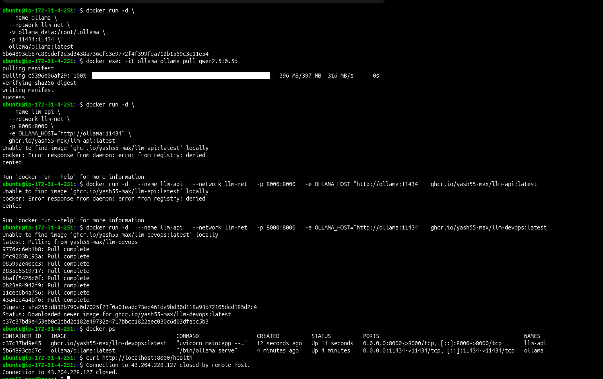
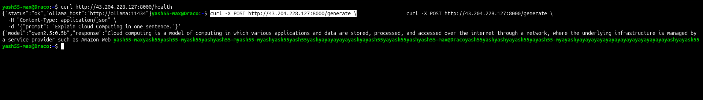
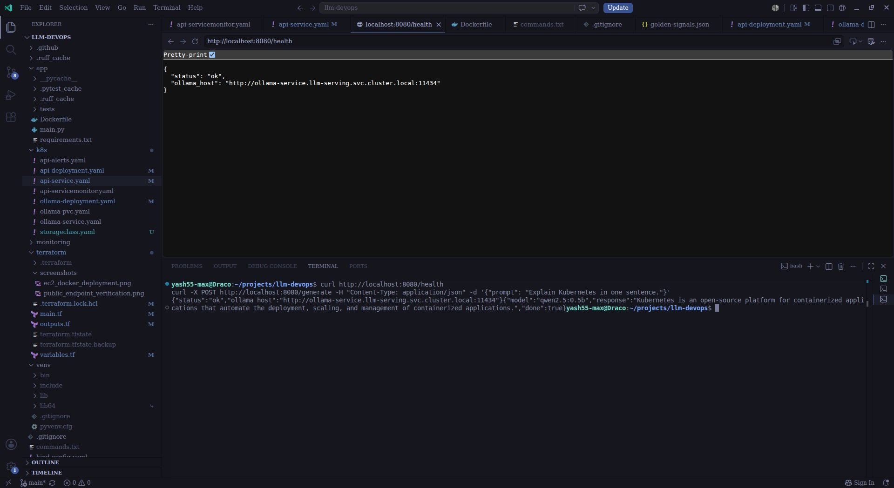
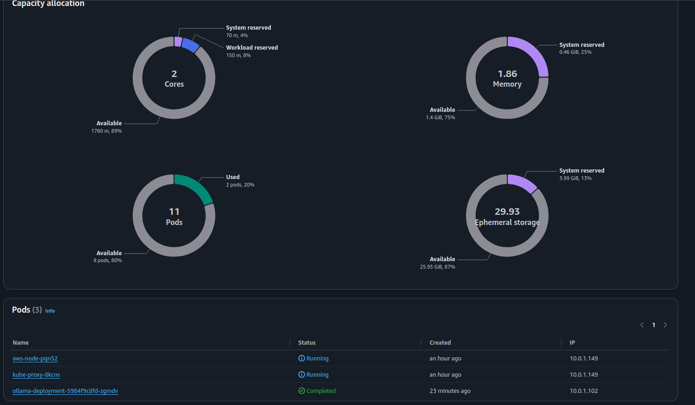
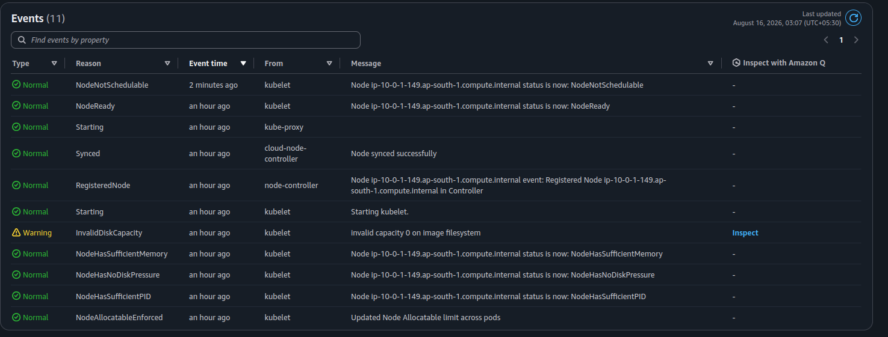

# LLM Infrastructure & MLOps Platform

End-to-end Kubernetes-based deployment platform for serving Open-Source LLMs with automated CI/CD, IaC, and Observability.

---

## Day 1: Infrastructure & Local Environment Baseline

### Accomplished

- [x] AWS Billing Guardrails configured with 10 alert caps
- [x] AWS CLI v2 configured with non-root IAM user (`yash-IAM-Admin`)
- [x] Local toolchain verified:
  - Docker v29
  - kubectl v1.36
  - kind v0.22
  - Terraform v1.15
- [x] Local 2-node Kubernetes cluster created using `kind`
  - Cluster: `devops-ai-cluster`
- [x] Ollama local model serving verified

### Architectural Rationale & Design Patterns

- **Non-root AWS IAM Access**: Used a dedicated IAM administrator identity instead of the AWS root account to reduce operational and security risk.

- **Local Kubernetes via kind**: Chosen to provide a reproducible multi-node Kubernetes environment without incurring cloud infrastructure costs during development.

- **Cost Guardrails**: AWS billing alerts were configured before beginning cloud infrastructure work to prevent unexpected resource consumption.

---

## Day 2: Containerized Ollama Deployment into `kind`

### Accomplished

- [x] Ollama containerized and deployed into the local `kind` cluster
- [x] Dedicated Kubernetes namespace configured for LLM serving
- [x] Persistent Volume Claim (`ollama-pvc`) created
- [x] Ollama model storage mounted at `/root/.ollama`
- [x] Init container implemented for automatic model bootstrap
- [x] `qwen2.5:0.5b` model configured for automatic download
- [x] Ollama serving container verified

### Architectural Rationale & Design Patterns

- **CPU-based Serving**: Retained Ollama GGUF quantized models on CPU to avoid GPU overhead and unnecessary infrastructure costs in local `kind` clusters.

- **Persistent Storage (`ollama-pvc`)**: Mounted a 5Gi PVC to `/root/.ollama` to decouple model-weight storage from pod lifecycles, eliminating unnecessary model re-downloads after pod restarts.

- **Init Container Bootstrap Pattern**: Introduced an `initContainer` named `model-puller` to verify Ollama readiness using `ollama list` and fetch `qwen2.5:0.5b` model weights before the primary serving container starts.

- **Container Lifecycle Separation**: Model initialization is isolated from the serving process, allowing the main Ollama container to start only after the required model artifacts are available.

---

## Day 3: Kubernetes Service Discovery & FastAPI Integration

### Accomplished

- [x] FastAPI application integrated with the Ollama backend
- [x] Kubernetes Service created for Ollama
- [x] FastAPI configured to communicate with Ollama through Kubernetes DNS
- [x] Hardcoded Pod IP addressing eliminated
- [x] Internal service communication established using the Kubernetes FQDN

### Architectural Rationale & Design Patterns

- **Kubernetes DNS-Based Service Discovery**: The FastAPI layer communicates with the Ollama backend using the Kubernetes CoreDNS domain:

  `http://ollama-service.llm-serving.svc.cluster.local:11434`

- **Dynamic IP Assignment**: Pod IPs and Service ClusterIPs are dynamic. Hardcoding IP addresses would make the application fragile whenever pods are rescheduled or services are recreated.

- **Namespace-Scoped Discovery**: Kubernetes Fully Qualified Domain Names follow the standard format:

  `<service-name>.<namespace>.svc.cluster.local`

  This allows services to communicate reliably across namespaces without depending on the underlying cluster topology.

- **Decoupled Architecture**: FastAPI depends on the stable Kubernetes Service abstraction rather than individual Ollama pods. This allows the Ollama backend to scale horizontally without requiring application-level configuration changes.

- **Service Abstraction**: Kubernetes Services provide a stable network endpoint and load-balancing layer in front of potentially multiple Ollama replicas.

### Service Communication Flow

```text
                    Kubernetes Cluster
┌─────────────────────────────────────────────────────────────┐
│                                                             │
│  ┌──────────────────┐                                       │
│  │   FastAPI Pod    │                                       │
│  │                  │                                       │
│  │  API / Inference │                                       │
│  └────────┬─────────┘                                       │
│           │                                                 │
│           │ Kubernetes DNS                                  │
│           │ ollama-service.llm-serving.svc.cluster.local    │
│           ▼                                                 │
│  ┌──────────────────┐                                       │
│  │ Ollama Service   │                                       │
│  │                  │                                       │
│  │ ClusterIP:11434  │                                       │
│  └────────┬─────────┘                                       │
│           │                                                 │
│           ▼                                                 │
│  ┌──────────────────┐                                       │
│  │   Ollama Pod     │                                       │
│  │                  │                                       │
│  │ qwen2.5:0.5b     │                                       │
│  └──────────────────┘                                       │
│                                                             │
└─────────────────────────────────────────────────────────────┘
```

---

## Day 4: Automated CI/CD Pipeline & Container Registry Integration

### Accomplished

- [x] Automated CI/CD workflow created using GitHub Actions (`.github/workflows/ci.yaml`)
- [x] Code quality and linting automated using `ruff`
- [x] Automated unit test suite implemented using `pytest`
- [x] Pydantic schema validation verified
- [x] `/health` probe logic verified
- [x] Container image builds automated
- [x] Container images published to GitHub Container Registry (GHCR)
- [x] Immutable image tagging strategy implemented using Git commit SHAs (`${{ github.sha }}`)

### Architectural Rationale & Design Patterns

- **Static Code Analysis (`ruff`)**: Integrated high-performance Python linting into the CI pipeline to enforce code-quality standards and maintain consistent import ordering before container image assembly.

- **Automated Verification (`pytest`)**: Unit tests execute automatically on every push and pull request targeting `main`. This provides an early validation layer for API behavior, Pydantic schemas, and health-check endpoints before artifacts are built.

- **Immutable Artifact Strategy**: Container images are tagged using the Git commit SHA (`${{ github.sha }}`), creating a deterministic relationship between source code and the resulting artifact. This avoids the ambiguity associated with mutable tags such as `:latest`.

- **GitHub Container Registry (GHCR)**: GHCR is used as the centralized container artifact registry, providing a persistent location for versioned images that can later be consumed by Kubernetes or a GitOps deployment controller.

- **Deliberate Deployment Boundary**: The CI pipeline intentionally terminates after publishing the container image. Automated deployment to the local `kind` cluster is excluded because GitHub-hosted runners cannot directly access the developer's local Kubernetes network namespace without additional tunneling or self-hosted infrastructure.

- **GitOps Readiness**: Stopping at artifact publication establishes a clean separation between **CI** and **CD**. The resulting immutable image can later become the deployment input for a remote Kubernetes cluster and GitOps controller.

### CI/CD Pipeline Flow

```text
                         Git Repository
                              │
                              │ Push / Pull Request
                              ▼
                    ┌─────────────────────┐
                    │    GitHub Actions   │
                    │      CI Runner      │
                    └──────────┬──────────┘
                               │
                  ┌────────────┼────────────┐
                  │            │            │
                  ▼            ▼            ▼
             ┌────────┐   ┌────────┐   ┌─────────────┐
             │  Ruff  │   │ Pytest │   │ Pydantic /  │
             │ Linting│   │  Tests │   │ Health Check│
             └────┬───┘   └────┬───┘   └──────┬──────┘
                  │            │              │
                  └────────────┼──────────────┘
                               │
                         Validation Pass
                               │
                               ▼
                    ┌─────────────────────┐
                    │  Docker Image Build │
                    └──────────┬──────────┘
                               │
                               │ Tag:
                               │ <github-sha>
                               ▼
                    ┌─────────────────────┐
                    │        GHCR         │
                    │ GitHub Container    │
                    │      Registry       │
                    └──────────┬──────────┘
                               │
                               │ Immutable Artifact
                               ▼
                    ┌─────────────────────┐
                    │   Future CD /       │
                    │   GitOps Layer      │
                    └──────────┬──────────┘
                               │
                               ▼
                    ┌─────────────────────┐
                    │ Remote Kubernetes   │
                    │      Cluster        │
                    └─────────────────────┘

                    ─────────────────────
                     CURRENT DAY 4 STOP
                    ─────────────────────
```

### Artifact Versioning Strategy

```text
Git Commit
   │
   │ abc1234...
   ▼
GitHub Actions
   │
   │ Docker Build
   ▼
GHCR Image
   │
   └── <image>:abc1234...

Source Code ───────────────► Container Image
     │                              │
     │                              │
     └──── Git SHA ─────────────────┘
              │
              ▼
        Full Traceability
```

### Key CI/CD Pattern

```text
Code
 │
 ▼
Lint
 │
 ▼
Test
 │
 ▼
Build
 │
 ▼
Tag with Git SHA
 │
 ▼
Push to GHCR
 │
 ▼
Future GitOps Deployment
```

---
---

## Day 5: Observability Stack — Prometheus, Grafana & Golden Signals Dashboard

### Accomplished
- [x] FastAPI application instrumented using `prometheus-fastapi-instrumentator`
- [x] `/metrics` endpoint exposed on the API service
- [x] `kube-prometheus-stack` deployed via Helm into a dedicated `monitoring` namespace
- [x] `ServiceMonitor` (`llm-api-servicemonitor`) configured to scrape the API service
- [x] Prometheus target verified as `UP` with successful scrape health
- [x] Grafana dashboard built with three golden-signal panels:
  - Request rate
  - P95 latency
  - Error rate
- [x] Dashboard exported as JSON and version-controlled (`monitoring/dashboards/golden-signals.json`)
- [x] Load-tested end-to-end pipeline to validate live metric flow

### Dashboard Preview


### Architectural Rationale & Design Patterns
- **`kube-prometheus-stack` over hand-rolled manifests**: Used the community Helm chart (Prometheus + Grafana + Alertmanager bundled) rather than deploying each component manually. This mirrors how most real infrastructure teams operate this stack and avoids reinventing scrape-config plumbing.
- **ServiceMonitor as the scrape-config abstraction**: Rather than editing Prometheus's scrape config directly, a `ServiceMonitor` CRD declares *what* to scrape declaratively, and the Prometheus Operator reconciles it. This is the standard Kubernetes-native pattern for metrics discovery.
- **Golden Signals over exhaustive metrics**: The dashboard intentionally limits scope to request rate, latency (p95), and error rate — the three signals most directly tied to service health — rather than dumping every available metric onto one panel. Readability over completeness.
- **Immutable image tagging paid off**: The Day 4 SHA-based tagging strategy made it trivial to distinguish "old code, still running" from "new code, not yet deployed" once the stale-image bug surfaced (see below).

### Debugging Log

This was the real work of the day. Every fix below was a genuine dead-end resolved by checking one layer deeper — documented here because tracing failures across a distributed system is a stronger signal of competency than a dashboard screenshot alone.

**1. Prometheus silently ignoring the ServiceMonitor (label selector mismatch)**
- Symptom: `ServiceMonitor` existed, but Prometheus's Service Discovery page showed nothing.
- Root cause: `kube-prometheus-stack`'s Prometheus CR only watches `ServiceMonitors` carrying a `release: prometheus-stack` label by default (`spec.serviceMonitorSelector.matchLabels`). The custom `ServiceMonitor` didn't have it, so it was invisible to Prometheus — no error, just silence.
- Fix: added `labels: { release: prometheus-stack }` to the `ServiceMonitor`'s metadata and re-applied.

**2. ServiceMonitor discovered, but "0/0 No targets"**
- Symptom: label fix resolved discovery, but the scrape pool showed zero targets.
- Root cause: the underlying `Service` (`llm-api-service`) had no live endpoints — meaning zero pods were actually running.
- Investigation: `kubectl get deployments -n llm-serving` showed both deployments at `0/0` desired replicas, with `kubectl get events` returning nothing (no crash, no OOM, no scheduling failure — replicas had simply been set to zero, without any recorded event trail).
- Fix: `kubectl scale deployment <name> -n llm-serving --replicas=1` for both deployments.

**3. Target `UP` in discovery, but scraping failed with `404 Not Found`**
- Symptom: pod resolved correctly, Prometheus reached it over the network, but `/metrics` returned 404.
- Root cause: the running pod was serving a stale image built on Day 3, before Prometheus instrumentation was added to `main.py` on Day 5. The code was correct — it had simply never been rebuilt and reloaded into the `kind` cluster.
- Fix: `docker build` → `kind load docker-image` → bumped the image tag in the Deployment manifest → `kubectl apply` → confirmed `/metrics` returned valid Prometheus-format output before re-checking Prometheus.

**4. Port drift between local YAML, live cluster state, and the container**
- Symptom: `kubectl port-forward` failed with "Service does not have a service port 8001."
- Root cause: `api-service.yaml` had been locally edited to `port: 8001` but never re-applied, while the Dockerfile and the live cluster Service were still on `8000` — three sources of truth had drifted out of sync with each other.
- Fix: reverted the Service manifest to `8000` (matching the Dockerfile's `EXPOSE`/`uvicorn --port`), re-applied, and confirmed live cluster state matched the file before proceeding.

**Takeaway:** every failure here traced back to a *silent* mismatch — a missing label, a stale image, a config file that was edited but never applied — none of which threw a loud error until the very last layer (`/targets` page, `curl`, or `port-forward`). This is the actual shape of Kubernetes/Prometheus debugging in production: work backward through the selector chain (Prometheus → ServiceMonitor → Service → Pod) one link at a time rather than guessing at the whole system.

### Observability Data Flow
```text
                    Kubernetes Cluster
┌───────────────────────────────────────────────────────────────┐
│                                                                 │
│  ┌──────────────────┐        /metrics        ┌───────────────┐│
│  │   FastAPI Pod    │◄───────────────────────│  Prometheus   ││
│  │  (instrumented)  │      scrape every 5s    │    Server     ││
│  └──────────────────┘                         └───────┬───────┘│
│                                                        │        │
│                                            ServiceMonitor       │
│                                          (release label match)  │
│                                                        │        │
│                                                        ▼        │
│                                              ┌───────────────┐  │
│                                              │    Grafana    │  │
│                                              │   Dashboard   │  │
│                                              │ (Golden Signals)│ │
│                                              └───────────────┘  │
│                                                                 │
└───────────────────────────────────────────────────────────────┘
```

### Golden Signals Queries
```promql
# Request Rate
sum(rate(http_requests_total{job="llm-api-service"}[1m]))

# P95 Latency
histogram_quantile(0.95, sum(rate(http_request_duration_seconds_bucket{job="llm-api-service"}[1m])) by (le))

# Error Rate
sum(rate(http_requests_total{job="llm-api-service", status=~"4..|5.."}[1m])) or vector(0)
```

---
---

## Day 6: Alerting — Alertmanager, PrometheusRule & Incident Lifecycle Validation

### Accomplished
- [x] Alertmanager enabled via Helm upgrade (was disabled by default in the original chart install)
- [x] Verified Prometheus → Alertmanager delivery path via `alerting.alertmanagers` config
- [x] Three `PrometheusRule` alerts authored and deployed (`k8s/api-alerts.yaml`):
  - `HighErrorRate` — fires when 5xx ratio exceeds 5% for 2+ minutes
  - `PodNotReady` — fires when any pod in `llm-serving` is not-ready for 1+ minute
  - `HighLatencyP95` — fires when p95 latency exceeds 2s for 5+ minutes
- [x] Forced a real outage (Ollama scaled to zero) to validate the full alert lifecycle
- [x] Confirmed alert transition: `Inactive` → `Pending` → `Firing` → resolved
- [x] Confirmed alert delivery into Alertmanager's UI, distinct from built-in `kube-system` noise alerts
- [x] Diagnosed and fixed a Grafana dashboard persistence bug (dashboards lost on pod restart)
- [x] Re-imported the golden-signals dashboard from Day 5's exported JSON and confirmed recovery

### Incident & Alert Validation Previews

#### Full Golden Signals Incident Lifecycle Dashboard


#### Error Rate Spike Drilldown (Threshold Breach at 01:03:30)


#### Prometheus Alert State Transition: Pending (01:04:48)
*Threshold breached; alert enters the 2-minute debounce window (`for: 2m`) to prevent transient false alarms:*


#### Prometheus Alert State Transition: Firing (01:06:23)
*Failure condition sustained for over 2 minutes; alert transitions to FIRING and routes to Alertmanager:*


### Architectural Rationale & Design Patterns
- **`PrometheusRule` over manual Alertmanager config**: Same declarative CRD pattern as `ServiceMonitor` — alert rules live as version-controlled Kubernetes objects, reconciled automatically by the Prometheus Operator, rather than hand-edited into a running config file.
- **`for:` durations on every rule**: Each alert requires its condition to hold for a sustained window (1-5 minutes depending on severity) before firing. This is a deliberate choice to avoid alert fatigue from single-request blips or transient scheduling noise — a core SRE practice, not just a Prometheus syntax requirement.
- **Real outage over synthetic testing**: Rather than trusting the rule YAML in isolation, the `HighErrorRate` alert was validated by actually taking a dependency offline (`ollama-deployment` scaled to zero) and observing the app's real failure behavior (`503` responses via the `httpx.ConnectError` handler built on Day 3). This proves the alert reflects genuine service degradation, not just a syntactically valid query.
- **Stateless Grafana as a design flaw, not a given**: Grafana's default Helm install stores dashboards in the pod's local SQLite database with no persistent volume. Any pod restart — Docker Desktop restart, resource pressure, node reschedule — silently wipes every UI-created dashboard with no warning. This is treated here as a bug to fix, not an accepted limitation.

### Debugging Log

**1. Alertmanager pods not running — “disabled” in Status page**
- Symptom: `kubectl get pods -n monitoring | grep alertmanager` returned nothing.
- Root cause: `alertmanager.enabled: false` had been explicitly set in the Helm values during the original Day 5 install (likely to conserve local CPU/memory during initial stack setup).
- Fix: `helm upgrade` with `--reuse-values` and `--set alertmanager.enabled=true`, plus deliberately small resource requests/limits to stay within the local `kind` cluster's CPU budget.
- Note: the Alertmanager UI's "Cluster Status: disabled" after fixing this was a false alarm — it refers to Alertmanager's gossip clustering for multi-replica HA, which is correctly disabled for a single-replica local instance. Not an error.

**2. Ten alerts appeared in Alertmanager that were never authored**
- Symptom: `namespace="kube-system"` group showed 10 firing alerts (`etcdInsufficientMembers`, `KubeProxyInstanceUnreachable`, `TargetDown`, etc.) immediately after enabling Alertmanager.
- Root cause: these are built-in control-plane health alerts shipped by default with `kube-prometheus-stack`. `kind` clusters don't expose the same control-plane metrics endpoints a managed cluster (EKS/GKE) does, so these fire continuously and are expected noise on any local `kind` setup — unrelated to the application.
- Resolution: documented as expected behavior rather than "fixed" — no config change needed, just correctly identified as out of scope.

**3. `HighErrorRate` rule wouldn't have fired against the original test plan**
- Initial plan was to hit a nonexistent route to generate 404s, but the rule's `status=~"5.."` filter only matches 5xx, not 4xx.
- Corrected the test plan instead of the rule: scaled `ollama-deployment` to zero, which makes `/generate` genuinely unreachable and produces real `503`s — matching the rule's actual intent (backend dependency failure) rather than a client-error edge case.

**4. Grafana dashboard vanished after a Helm upgrade — "Dashboard not found"**
- Symptom: the Day 5 golden-signals dashboard, previously working, returned a 404 inside Grafana after enabling Alertmanager and later after enabling Grafana persistence.
- Root cause: Grafana's dashboards are stored in an internal SQLite DB inside the pod's ephemeral filesystem by default. Every pod restart (including the one triggered by `helm upgrade` itself) wipes any dashboard created through the UI.
- Fix (short-term): re-imported the dashboard from the JSON exported on Day 5 (`monitoring/dashboards/golden-signals.json`) — validating that the earlier discipline of exporting dashboards-as-code, not just building them in the UI, was what made recovery possible.
- Fix (long-term): `helm upgrade` with `--set grafana.persistence.enabled=true --set grafana.persistence.size=1Gi`, mounting a PVC so Grafana's state survives future pod restarts.

**5. "Failed to fetch" after the persistence fix**
- Symptom: dashboard loaded, but all three panels showed "No data" with a "Failed to fetch" banner.
- Root cause: enabling persistence restarted the Grafana pod, invalidating the existing `kubectl port-forward` tunnel, which was still pointed at the terminated pod.
- Fix: killed and restarted the port-forward against the new pod/service, confirmed connectivity, panels populated immediately.

**Takeaway:** today's failures were less about Kubernetes/Prometheus mechanics (those are largely solved from Day 5) and more about state and lifecycle assumptions — assuming a running pod is a stable pod, and assuming "it worked in the UI" means it's durable. Exporting dashboards as versioned JSON, small as that habit seemed on Day 5, was the difference between a five-minute recovery and losing the whole panel layout.

### Incident Lifecycle — Validated End to End

> [!IMPORTANT]
> **Incident Lifecycle Dashboard Callout — The Complete Outage Narrative in One View:**
> The incident-lifecycle dashboard screenshot above ([`monitoring/dashboards/incident_lifecycle_dashboard.png`](file:///home/yash55-max/projects/llm-devops/monitoring/dashboards/incident_lifecycle_dashboard.png)) captures the entire operational narrative across time in a single pane of glass rather than just a static snapshot:
> 1. **Baseline Operations**: Steady nominal traffic (~0.4 req/s), baseline P95 latency (~90ms), and error rate flatlined at zero.
> 2. **Fault Injection (01:03:30)**: Ollama deployment scaled to zero replicas (`kubectl scale deployment ollama-deployment --replicas=0`), cutting off the LLM inference backend.
> 3. **Error Spike & Metric Surge**: FastAPI gracefully catches the connection drops (`httpx.ConnectError`) and issues HTTP 503 responses. The Error Rate panel surges to ~0.49 req/s (100% failure ratio matching the request rate), immediately crossing the 5% error ratio threshold ([`monitoring/dashboards/error-rate.png`](file:///home/yash55-max/projects/llm-devops/monitoring/dashboards/error-rate.png)).
> 4. **Alert Transition (Pending $\rightarrow$ Firing)**: Prometheus marks `HighErrorRate` as **Pending** at 01:04:48 ([`monitoring/dashboards/alert_pending.png`](file:///home/yash55-max/projects/llm-devops/monitoring/dashboards/alert_pending.png)). Once the 2-minute `for:` window elapses at 01:06:23, it transitions to **Firing** ([`monitoring/dashboards/alert_firing.png`](file:///home/yash55-max/projects/llm-devops/monitoring/dashboards/alert_firing.png)) and dispatches to Alertmanager.
> 5. **Remediation & Recovery**: Ollama deployment scaled back up to 1 replica. The error rate immediately plunges back to zero and Alertmanager auto-resolves the alert back to `Inactive`.

```text
 1. Baseline           Ollama healthy, error rate = 0, all alerts Inactive
         │
         ▼
 2. Fault injected      kubectl scale deployment ollama-deployment --replicas=0
         │
         ▼
 3. App detects failure  httpx.ConnectError → FastAPI returns 503
         │
         ▼
 4. Metric shifts        error rate ratio crosses 5% threshold
         │
         ▼
 5. Rule evaluates true  HighErrorRate: Inactive → Pending (01:04:48)
         │
         │  (condition holds for full `for: 2m` window)
         ▼
 6. Alert fires          HighErrorRate: Pending → Firing (01:06:23)
         │
         ▼
 7. Delivered            Alert appears in Alertmanager UI
         │
         ▼
 8. Fault resolved       kubectl scale deployment ollama-deployment --replicas=1
         │
         ▼
 9. Alert clears         HighErrorRate: Firing → Inactive
```

### Alert Rules Summary
```promql
# HighErrorRate — 5xx ratio > 5% for 2m
sum(rate(http_requests_total{job="llm-api-service", status=~"5.."}[5m]))
/
sum(rate(http_requests_total{job="llm-api-service"}[5m])) > 0.05

# PodNotReady — any pod not-ready for 1m
kube_pod_status_ready{namespace="llm-serving", condition="true"} == 0

# HighLatencyP95 — p95 latency > 2s for 5m
histogram_quantile(0.95, sum(rate(http_request_duration_seconds_bucket{job="llm-api-service"}[5m])) by (le)) > 2
```

---
---

## Day 7: Cloud Migration — AWS EC2 via Terraform

### Accomplished
- [x] Provisioned real AWS infrastructure using Terraform (`terraform/`):
  - Single `t3.micro` EC2 instance (Ubuntu, 25Gi gp3 root volume)
  - Dedicated security group scoped to the operator's IP only (SSH + port 8000)
  - SSH key pair generated and managed via Terraform, not manually uploaded
- [x] Installed Docker on the EC2 instance
- [x] Deployed both containers directly via `docker run` (Docker-only today, not Kubernetes — EKS migration deliberately deferred to a later day)
- [x] Created a custom Docker bridge network (`llm-net`) so the API container reaches Ollama by container name, not a hardcoded IP
- [x] Pulled the API image from GHCR (Day 4's registry pipeline used in production for the first time)
- [x] Verified `/health` and `/generate` endpoints responding correctly over the public internet, not just `localhost`
- [x] Confirmed full teardown via `terraform destroy` — zero resources left running after verification

### Deployment & Verification Previews

#### EC2 Container Setup & Docker Bridge Network
*Ollama initialization, model pull (`qwen2.5:0.5b`), resolving the GHCR container image name, and running both services under the custom `llm-net` network on AWS EC2:*


#### Public Internet Endpoint Verification
*Live endpoint verification over the public EC2 IPv4 address (`43.204.228.127:8000`) for both `/health` and `/generate` inference:*


### Architectural Rationale & Design Patterns
- **EC2 + Docker before EKS**: deliberately scoped today to plain Docker on a single EC2 instance rather than jumping straight to a managed Kubernetes control plane. EKS's control plane alone costs roughly $73/month if left running — not worth the spend or the added complexity before the basic cloud-networking and registry-auth pieces were proven to work. EKS migration is planned as a separate, later effort, reusing the Kubernetes manifests already written on Days 2-6.
- **IP-scoped security group, not `0.0.0.0/0`**: both SSH (22) and the API port (8000) are restricted to the operator's IP via a Terraform `data.http` lookup at apply time, rather than exposing an unauthenticated LLM endpoint to the entire internet. A convenient default for tutorials, but not one worth carrying into a portfolio project meant to demonstrate real judgment.
- **Docker bridge network for service discovery**: the `llm-net` custom network lets the API container resolve Ollama via its container name (`http://ollama:11434`) rather than a hardcoded IP — the same DNS-based service-discovery principle established in Day 3's Kubernetes work, applied at the Docker level instead. Reinforces that the pattern isn't Kubernetes-specific; it's a general "don't hardcode network identity" practice.
- **Immutable image, reused, not rebuilt**: the exact image built and pushed to GHCR in Day 4's CI pipeline was pulled and run unmodified on EC2 — the artifact produced by CI is the same artifact deployed here, no local rebuild step. This is the traceability the SHA-tagging strategy was meant to provide, now exercised for real.
- **Aggressive teardown discipline**: infrastructure was destroyed immediately after verification rather than left running for convenience. With a fixed $110 credit budget, `terraform destroy` after every session — not "when I remember to" — is the operating discipline, not an afterthought.

### Debugging Log

**1. GHCR pull denied — "docker: Error response from daemon: error from registry: denied"**
- Symptom: `docker run` against `ghcr.io/yash55-max/llm-api:latest` failed twice with a registry `denied` error.
- Root cause: simple naming mismatch — the package was actually published under `llm-devops`, not `llm-api`. Not a permissions or authentication issue; the image genuinely didn't exist at the referenced path.
- Fix: corrected the image reference to `ghcr.io/yash55-max/llm-devops:latest`, pull succeeded immediately ([`terraform/screenshots/ec2_docker_deployment.png`](file:///home/yash55-max/projects/llm-devops/terraform/screenshots/ec2_docker_deployment.png)).

**2. SSH session dropped mid-verification — "Connection to 43.204.228.127 closed by remote host"**
- Symptom: SSH session terminated unexpectedly right after successful endpoint testing.
- Root cause: not a fault — `terraform destroy` was run from a separate local terminal immediately after the public-IP curl tests succeeded, tearing down the EC2 instance out from under the active SSH session ([`terraform/screenshots/ec2_docker_deployment.png`](file:///home/yash55-max/projects/llm-devops/terraform/screenshots/ec2_docker_deployment.png)). Expected behavior given the intentional teardown discipline, not a bug.

### Verified Public Endpoint
```bash
curl http://43.204.228.127:8000/health
# {"status":"ok","ollama_host":"http://ollama:11434"}

curl -X POST http://43.204.228.127:8000/generate \
  -H "Content-Type: application/json" \
  -d '{"prompt": "Explain Cloud Computing in one sentence."}'
# {"model":"qwen2.5:0.5b","response":"Cloud computing is a model of computing in which
#  various applications and data are stored, processed, and accessed over the internet
#  through a network, where the underlying infrastructure is managed by a service provider
#  such as Amazon Web Services..."}
```

### Deployment Flow
```text
 Local machine                     GitHub                          AWS
┌──────────────┐   git push   ┌───────────────┐  docker build  ┌──────────────┐
│  Source code │ ────────────▶│ GitHub Actions │────────────────▶│     GHCR     │
└──────────────┘               │   CI Pipeline  │   push (SHA)   │  (registry)  │
                               └───────────────┘                 └──────┬───────┘
                                                                        │
                                                     terraform apply    │ docker pull
                                                            │           ▼
                                                            ▼    ┌──────────────┐
                                                     ┌─────────┐ │  EC2 t3.micro│
                                                     │Terraform│▶│  Docker Host │
                                                     └─────────┘ │              │
                                                                 │ ┌──────────┐ │
                                                                 │ │ llm-api  │ │
                                                                 │ │  :8000   │ │
                                                                 │ └────┬─────┘ │
                                                                 │      │llm-net│
                                                                 │ ┌────▼─────┐ │
                                                                 │ │  ollama  │ │
                                                                 │ │  :11434  │ │
                                                                 │ └──────────┘ │
                                                                 └──────────────┘
                                                                        │
                                                              curl (public IP)
                                                                        │
                                                                        ▼
                                                                Verified from
                                                                local machine

                                              terraform destroy (immediately after)
                                                        │
                                                        ▼
                                              All resources terminated
```

### Budget Note
Instance ran for the duration of one build-and-verify session only. `terraform destroy` confirmed 3/3 resources destroyed (`aws_instance`, `aws_key_pair`, `aws_security_group`) with no residual billing.

---
---

## Day 8: Cloud-Native Migration — EKS, IRSA & Production Kubernetes Friction

### Accomplished
- [x] Extended existing Terraform (not a rewrite) to provision a real EKS cluster:
  - EKS control plane (Kubernetes 1.35, standard support)
  - Managed node group (2x `t3.small`, Free Tier eligible)
  - Dedicated cluster and node IAM roles
  - EBS CSI driver add-on with proper IRSA binding
  - OIDC provider for IAM Roles for Service Accounts (IRSA)
- [x] Reapplied existing Kubernetes manifests from Days 2-6 (`k8s/`) onto real managed infrastructure with minimal changes, proving portability from local `kind`
- [x] Created a `StorageClass` (`ebs-gp3`, set as default) to enable dynamic EBS-backed PVC provisioning
- [x] Right-sized Ollama's memory `requests`/`limits` for real node capacity, replacing values inherited from an unconstrained local Docker environment
- [x] Fixed image references and added a GHCR pull secret so the API deployment could actually pull its private image on a cluster with no pre-existing Docker credentials
- [x] Verified full end-to-end request flow on real cloud infrastructure: `curl` → API pod → Kubernetes DNS → Ollama pod → response
- [x] Confirmed complete teardown via `terraform destroy`, including a manual check for orphaned EBS volumes left behind by dynamic provisioning

### Deployment & Verification Previews

#### EKS End-to-End Endpoint Verification
*Port-forwarded verification of `/health` and live `/generate` inference via Kubernetes DNS across real EKS pods (`ollama-service.llm-serving.svc.cluster.local:11434`):*


#### EKS Node Capacity & Pod Allocation
*AWS EKS console overview of `t3.small` worker node capacity allocation (CPU, memory reservations) and running workload pods:*


#### AWS EKS Node & Kubelet Lifecycle Events
*Kubelet registration, allocatable limits enforcement, readiness, and scheduling event stream on the provisioned EKS node:*


### Architectural Rationale & Design Patterns
- **Extend existing Terraform rather than start a new module**: the EKS resources (cluster, node group, IAM, IRSA, addon) were added directly into the same `main.tf` used for earlier infrastructure, keeping one source of truth for the project's cloud footprint rather than fragmenting IaC across multiple untracked configurations.
- **Free Tier-eligible node sizing, deliberately verified rather than assumed**: `t3.small` was chosen only after confirming via `aws ec2 describe-instance-types --filters "Name=free-tier-eligible,Values=true"` that it was genuinely eligible on this account — not assumed from general AWS documentation, which can lag actual account-level enforcement.
- **IRSA over node-role IAM for the CSI driver**: the EBS CSI controller calls AWS APIs directly (CreateVolume, AttachVolume, etc.) and is scoped its own dedicated IAM role bound via OIDC/IRSA to its specific Kubernetes service account, rather than inheriting broad permissions from the underlying EC2 node's role. This follows the principle of least privilege that's specifically expected on production EKS clusters, and is different from how the simpler Day 7 EC2/Docker setup handled permissions.
- **Manifest portability as the actual point of the exercise**: the Kubernetes objects themselves (Deployments, Services, PVCs) required almost no changes between `kind` and EKS — the friction was entirely in the surrounding cloud plumbing (IAM, storage classes, image registries, resource sizing), which is the realistic split between "Kubernetes knowledge" and "cloud operations knowledge."
- **Right-sizing resource requests per environment, not copy-pasting them**: Ollama's `1Gi` memory request, fine on a local machine with abundant free RAM, was tight enough on a real `2GB` node (after system/CNI/CSI overhead) to block scheduling entirely. This is treated as a deliberate lesson, not a bug — manifests written for one environment carry implicit assumptions that don't automatically hold in another.

### Debugging Log

**1. EKS cluster created with an end-of-support Kubernetes version**
- Symptom: console flagged "Kubernetes version no longer supported by Amazon EKS" immediately after cluster creation.
- Root cause: `main.tf` had `version = "1.30"` hardcoded, which had aged out of EKS's standard support window by the time of provisioning.
- Fix: destroyed the just-created control plane immediately (cheap at this stage — no node group yet) and reprovisioned with `version = "1.35"`, confirmed via the console to carry standard support until March 2027.

**2. Node group launch failure — `AsgInstanceLaunchFailures: InvalidParameterCombination`**
- Symptom: node group sat in `CREATING` for over 30 minutes with an empty `health.issues` array, giving no early signal anything was wrong. AWS CLI checks (`describe-nodegroup`, `describe-instances`) showed zero EC2 instances had even launched.
- Root cause: `t3.medium`, the originally configured instance type, is not Free Tier-eligible on this account. The ASG silently failed to launch any instances rather than erroring immediately.
- Fix: switched to `t3.small`, confirmed Free Tier-eligible via `describe-instance-types`, node group succeeded in under 2 minutes.
- Lesson: EKS node group failures don't always surface fast — the AWS console's "Health issues" tab found the root cause instantly, faster than digging through Terraform/CLI output. Check the console first on unexplained multi-minute hangs.

**3. Stale Terraform state lock after an interrupted `apply`**
- Symptom: `Error acquiring the state lock` blocking all further Terraform commands.
- Root cause: an earlier `apply` had been killed mid-operation (in response to the node group hang above), leaving a lock that the local backend couldn't automatically release, and `terraform force-unlock` itself failed with `"Local state cannot be unlocked by another process"` despite no live process actually holding the file.
- Fix: verified via `lsof`/`fuser` that nothing was genuinely holding the state file, then proceeded with `-lock=false` for a one-time, deliberately-scoped bypass — acceptable here specifically because concurrent access had already been ruled out, not a general practice.
- Lesson: local Terraform state plus interrupted operations is a known solo-development pain point; remote state with proper locking (S3 + DynamoDB) exists specifically to handle this more gracefully.

**4. EBS CSI controller pods `CrashLoopBackOff` with HTTP 500 on liveness probe**
- Symptom: node-plugin CSI pods (local, no AWS API calls) ran fine; controller pods (which call AWS APIs like `CreateVolume`) failed to become healthy, cycling through all sidecar containers restarting repeatedly.
- Root cause: the node IAM role had `AmazonEBSCSIDriverPolicy` attached, but the CSI *controller* pod doesn't inherit node-level IAM by default on modern EKS — it requires its own dedicated IAM role bound to its specific Kubernetes service account via IRSA (IAM Roles for Service Accounts), which requires an OIDC identity provider to exist for the cluster.
- Fix: added `aws_iam_openid_connect_provider`, a dedicated `aws_iam_role.ebs_csi_irsa` trusted only by `system:serviceaccount:kube-system:ebs-csi-controller-sa`, and pointed the addon at it via `service_account_role_arn`.
- Complication: updating `service_account_role_arn` on an *already-existing* addon (created without IRSA) hung for the full 20-minute AWS provider timeout without completing. Recreating the addon fresh (`tainted`, forced replace) with IRSA specified from creation resolved it in under a minute — suggesting in-place IRSA retrofits on EKS addons are a rough edge worth avoiding when possible.

**5. PVC stuck `Pending` — no default StorageClass**
- Symptom: even after the CSI driver was healthy, `ollama-pvc` remained unbound.
- Root cause: `kind` provided `local-path-storage` as a default StorageClass automatically; EKS provides no default at all out of the box. The CSI driver being healthy doesn't create a StorageClass — that's a separate, explicit step.
- Fix: created `k8s/storageclass.yaml` (`ebs-gp3`, `provisioner: ebs.csi.aws.com`, marked `is-default-class: true`), which unblocked binding immediately once a pod requiring it was scheduled (`WaitForFirstConsumer` binding mode).

**6. Ollama pod `Pending` — insufficient memory**
- Symptom: after the PVC issue resolved, scheduling failed with `Insufficient memory` across both nodes.
- Root cause: Ollama's deployment requested `1Gi` memory, a value carried over from local `kind` (effectively unconstrained RAM via Docker Desktop). On real `t3.small` nodes (2GB total, meaningfully less after system/CNI/CSI overhead), that request didn't fit alongside what was already committed ([`terraform/screenshots/eks_node_capacity_allocation.png`](file:///home/yash55-max/projects/llm-devops/terraform/screenshots/eks_node_capacity_allocation.png)).
- Fix: lowered the request to `512Mi` (limit kept generous at `1.5Gi`) — comfortably sufficient for a 0.5B-parameter quantized model, and the pod scheduled immediately.

**7. API pod `ImagePullBackOff` — missing registry prefix, then missing pull secret**
- Symptom: kubelet reported pull failures against `docker.io/library/llm-api:day5` — a Docker Hub path that was never the actual image location.
- Root cause: the manifest's `image:` field had no registry prefix at all, a gap invisible on `kind` because the image had been `kind load docker-image`'d locally and never needed to resolve a real registry path.
- Fix: corrected the reference to `ghcr.io/yash55-max/llm-devops:9f254a0` (verified locally via `docker pull` first), then created a `ghcr-secret` (`kubectl create secret docker-registry`) and added `imagePullSecrets` to the deployment, since the private GHCR package still required authentication even with the correct path.

**8. Service `targetPort` didn't match the container's actual listening port**
- Symptom: `kubectl port-forward` succeeded at the network level but every request returned "connection refused" from inside the pod's network namespace.
- Root cause: `api-service.yaml`'s `targetPort` was `8001`, left over from a fix applied directly to a *previous* live cluster's state on Day 6, but never corrected in the source-controlled YAML itself — so the drift resurfaced identically on this fresh cluster.
- Fix: corrected both `port` and `targetPort` to `8000`, matching the container's actual `EXPOSE`/`uvicorn --port` value.
- Lesson: fixing a live cluster's resource without updating the tracked manifest just defers the same bug to the next `kubectl apply -f` — worth treating "fix applied" and "fix committed to source" as two separate, both-required steps.

**Takeaway**: today's failures were almost entirely EKS-specific gaps that `kind` had been silently covering for — default storage classes, IRSA-based AWS API auth, real per-node resource accounting, and registry resolution. None of these are Kubernetes problems in the abstract; they're the concrete difference between "runs a manifest" and "operates managed cloud Kubernetes," which is precisely the distinction this project is meant to demonstrate.

### Verified End-to-End (Real EKS Cluster)
*Live endpoint and inference verification on EKS ([`terraform/screenshots/eks_endpoint_verification.png`](file:///home/yash55-max/projects/llm-devops/terraform/screenshots/eks_endpoint_verification.png)):*
```bash
curl http://localhost:8080/health
# {"status":"ok","ollama_host":"http://ollama-service.llm-serving.svc.cluster.local:11434"}

curl -X POST http://localhost:8080/generate \
  -H "Content-Type: application/json" \
  -d '{"prompt": "Explain Kubernetes in one sentence."}'
# {"model":"qwen2.5:0.5b","response":"Kubernetes is an open-source platform for
#  containerized applications that automate the deployment, scaling, and management
#  of containerized applications.","done":true}
```

### EKS Architecture
```text
                              AWS (ap-south-1)
┌───────────────────────────────────────────────────────────────────────┐
│  VPC (10.0.0.0/16)                                                     │
│  ┌─────────────────┐         ┌─────────────────┐                      │
│  │  Public Subnet 1 │         │  Public Subnet 2 │                      │
│  │  (ap-south-1a)   │         │  (ap-south-1b)   │                      │
│  └────────┬─────────┘         └────────┬─────────┘                      │
│           │                            │                                │
│  ┌────────▼────────────────────────────▼─────────┐                      │
│  │            EKS Control Plane (v1.35)           │                      │
│  └────────┬────────────────────────────┬──────────┘                      │
│           │                            │                                │
│  ┌────────▼─────────┐         ┌────────▼─────────┐                      │
│  │  t3.small node 1  │         │  t3.small node 2  │                      │
│  │  ┌──────────────┐ │         │  ┌──────────────┐ │                      │
│  │  │  llm-api pod │ │         │  │  ollama pod  │ │                      │
│  │  │    :8000     │◄┼─────────┼─▶│    :11434    │ │                      │
│  │  └──────────────┘ │  DNS    │  └──────┬───────┘ │                      │
│  │  ┌──────────────┐ │         │         │ PVC     │                      │
│  │  │ EBS CSI (IRSA)│ │         │  ┌──────▼───────┐ │                      │
│  │  └──────────────┘ │         │  │ EBS gp3 vol  │ │                      │
│  └───────────────────┘         │  └──────────────┘ │                      │
│                                 └───────────────────┘                      │
└───────────────────────────────────────────────────────────────────────┘
         ▲
         │ OIDC / IRSA trust
         │
┌────────┴─────────┐
│  IAM: ebs-csi-irsa│  (scoped to system:serviceaccount:kube-system:ebs-csi-controller-sa)
└───────────────────┘
```

### Budget & Cleanup
Full teardown via `terraform destroy` after verification. Dynamically-provisioned EBS volumes (created by the CSI driver via PVC, not directly by Terraform) were checked separately post-destroy to rule out orphaned billing:
```bash
aws ec2 describe-volumes --region ap-south-1 \
  --filters "Name=status,Values=available" \
  --query 'Volumes[].{ID:VolumeId,Size:Size,Created:CreateTime}'
```

---
