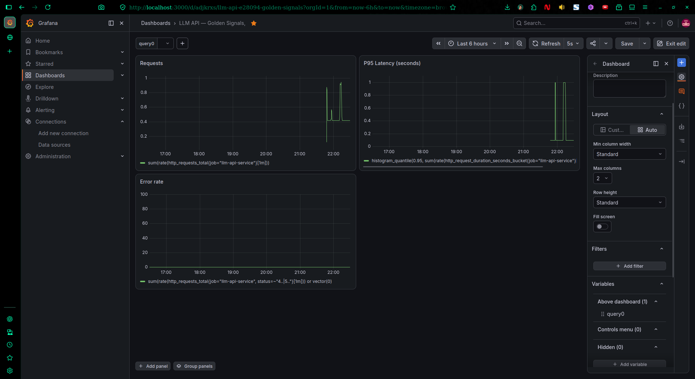
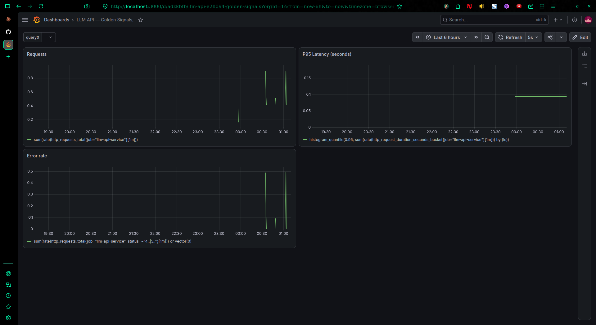
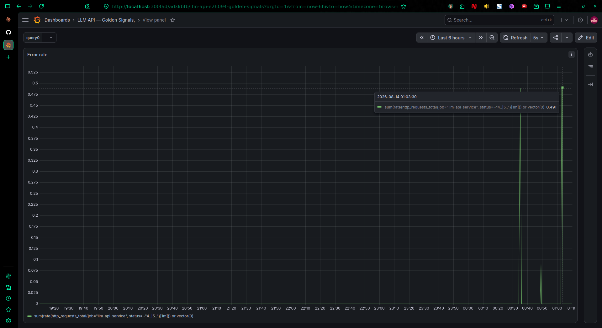
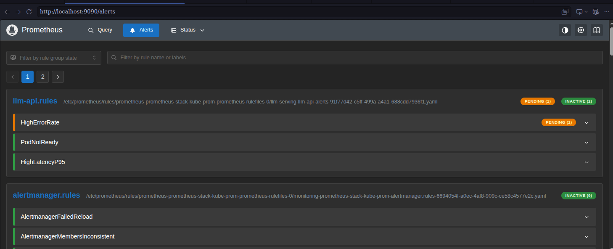
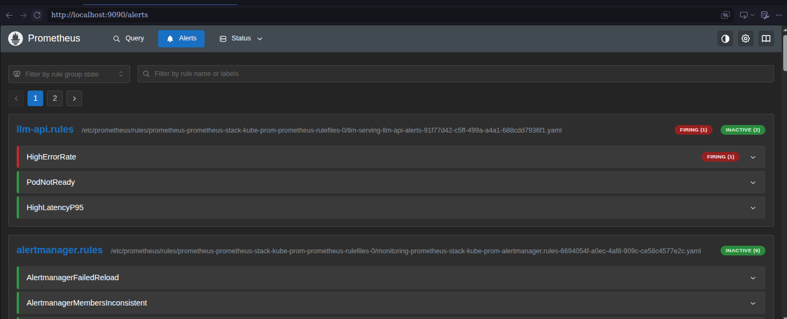

# LLM Infrastructure & MLOps Platform

End-to-end Kubernetes-based deployment platform for serving Open-Source LLMs with automated CI/CD, IaC, and Observability.

---

## Day 1: Infrastructure & Local Environment Baseline

### Accomplished

- [x] AWS Billing Guardrails configured with 10 alert caps
- [x] AWS CLI v2 configured with non-root IAM user (`yash-IAM-Admin`)
- [x] Local toolchain verified:
  - Docker v29
  - kubectl v1.36
  - kind v0.22
  - Terraform v1.15
- [x] Local 2-node Kubernetes cluster created using `kind`
  - Cluster: `devops-ai-cluster`
- [x] Ollama local model serving verified

### Architectural Rationale & Design Patterns

- **Non-root AWS IAM Access**: Used a dedicated IAM administrator identity instead of the AWS root account to reduce operational and security risk.

- **Local Kubernetes via kind**: Chosen to provide a reproducible multi-node Kubernetes environment without incurring cloud infrastructure costs during development.

- **Cost Guardrails**: AWS billing alerts were configured before beginning cloud infrastructure work to prevent unexpected resource consumption.

---

## Day 2: Containerized Ollama Deployment into `kind`

### Accomplished

- [x] Ollama containerized and deployed into the local `kind` cluster
- [x] Dedicated Kubernetes namespace configured for LLM serving
- [x] Persistent Volume Claim (`ollama-pvc`) created
- [x] Ollama model storage mounted at `/root/.ollama`
- [x] Init container implemented for automatic model bootstrap
- [x] `qwen2.5:0.5b` model configured for automatic download
- [x] Ollama serving container verified

### Architectural Rationale & Design Patterns

- **CPU-based Serving**: Retained Ollama GGUF quantized models on CPU to avoid GPU overhead and unnecessary infrastructure costs in local `kind` clusters.

- **Persistent Storage (`ollama-pvc`)**: Mounted a 5Gi PVC to `/root/.ollama` to decouple model-weight storage from pod lifecycles, eliminating unnecessary model re-downloads after pod restarts.

- **Init Container Bootstrap Pattern**: Introduced an `initContainer` named `model-puller` to verify Ollama readiness using `ollama list` and fetch `qwen2.5:0.5b` model weights before the primary serving container starts.

- **Container Lifecycle Separation**: Model initialization is isolated from the serving process, allowing the main Ollama container to start only after the required model artifacts are available.

---

## Day 3: Kubernetes Service Discovery & FastAPI Integration

### Accomplished

- [x] FastAPI application integrated with the Ollama backend
- [x] Kubernetes Service created for Ollama
- [x] FastAPI configured to communicate with Ollama through Kubernetes DNS
- [x] Hardcoded Pod IP addressing eliminated
- [x] Internal service communication established using the Kubernetes FQDN

### Architectural Rationale & Design Patterns

- **Kubernetes DNS-Based Service Discovery**: The FastAPI layer communicates with the Ollama backend using the Kubernetes CoreDNS domain:

  `http://ollama-service.llm-serving.svc.cluster.local:11434`

- **Dynamic IP Assignment**: Pod IPs and Service ClusterIPs are dynamic. Hardcoding IP addresses would make the application fragile whenever pods are rescheduled or services are recreated.

- **Namespace-Scoped Discovery**: Kubernetes Fully Qualified Domain Names follow the standard format:

  `<service-name>.<namespace>.svc.cluster.local`

  This allows services to communicate reliably across namespaces without depending on the underlying cluster topology.

- **Decoupled Architecture**: FastAPI depends on the stable Kubernetes Service abstraction rather than individual Ollama pods. This allows the Ollama backend to scale horizontally without requiring application-level configuration changes.

- **Service Abstraction**: Kubernetes Services provide a stable network endpoint and load-balancing layer in front of potentially multiple Ollama replicas.

### Service Communication Flow

```text
                    Kubernetes Cluster
┌─────────────────────────────────────────────────────────────┐
│                                                             │
│  ┌──────────────────┐                                       │
│  │   FastAPI Pod    │                                       │
│  │                  │                                       │
│  │  API / Inference │                                       │
│  └────────┬─────────┘                                       │
│           │                                                 │
│           │ Kubernetes DNS                                  │
│           │ ollama-service.llm-serving.svc.cluster.local    │
│           ▼                                                 │
│  ┌──────────────────┐                                       │
│  │ Ollama Service   │                                       │
│  │                  │                                       │
│  │ ClusterIP:11434  │                                       │
│  └────────┬─────────┘                                       │
│           │                                                 │
│           ▼                                                 │
│  ┌──────────────────┐                                       │
│  │   Ollama Pod     │                                       │
│  │                  │                                       │
│  │ qwen2.5:0.5b     │                                       │
│  └──────────────────┘                                       │
│                                                             │
└─────────────────────────────────────────────────────────────┘
```

---

## Day 4: Automated CI/CD Pipeline & Container Registry Integration

### Accomplished

- [x] Automated CI/CD workflow created using GitHub Actions (`.github/workflows/ci.yaml`)
- [x] Code quality and linting automated using `ruff`
- [x] Automated unit test suite implemented using `pytest`
- [x] Pydantic schema validation verified
- [x] `/health` probe logic verified
- [x] Container image builds automated
- [x] Container images published to GitHub Container Registry (GHCR)
- [x] Immutable image tagging strategy implemented using Git commit SHAs (`${{ github.sha }}`)

### Architectural Rationale & Design Patterns

- **Static Code Analysis (`ruff`)**: Integrated high-performance Python linting into the CI pipeline to enforce code-quality standards and maintain consistent import ordering before container image assembly.

- **Automated Verification (`pytest`)**: Unit tests execute automatically on every push and pull request targeting `main`. This provides an early validation layer for API behavior, Pydantic schemas, and health-check endpoints before artifacts are built.

- **Immutable Artifact Strategy**: Container images are tagged using the Git commit SHA (`${{ github.sha }}`), creating a deterministic relationship between source code and the resulting artifact. This avoids the ambiguity associated with mutable tags such as `:latest`.

- **GitHub Container Registry (GHCR)**: GHCR is used as the centralized container artifact registry, providing a persistent location for versioned images that can later be consumed by Kubernetes or a GitOps deployment controller.

- **Deliberate Deployment Boundary**: The CI pipeline intentionally terminates after publishing the container image. Automated deployment to the local `kind` cluster is excluded because GitHub-hosted runners cannot directly access the developer's local Kubernetes network namespace without additional tunneling or self-hosted infrastructure.

- **GitOps Readiness**: Stopping at artifact publication establishes a clean separation between **CI** and **CD**. The resulting immutable image can later become the deployment input for a remote Kubernetes cluster and GitOps controller.

### CI/CD Pipeline Flow

```text
                         Git Repository
                              │
                              │ Push / Pull Request
                              ▼
                    ┌─────────────────────┐
                    │    GitHub Actions   │
                    │      CI Runner      │
                    └──────────┬──────────┘
                               │
                  ┌────────────┼────────────┐
                  │            │            │
                  ▼            ▼            ▼
             ┌────────┐   ┌────────┐   ┌─────────────┐
             │  Ruff  │   │ Pytest │   │ Pydantic /  │
             │ Linting│   │  Tests │   │ Health Check│
             └────┬───┘   └────┬───┘   └──────┬──────┘
                  │            │              │
                  └────────────┼──────────────┘
                               │
                         Validation Pass
                               │
                               ▼
                    ┌─────────────────────┐
                    │  Docker Image Build │
                    └──────────┬──────────┘
                               │
                               │ Tag:
                               │ <github-sha>
                               ▼
                    ┌─────────────────────┐
                    │        GHCR         │
                    │ GitHub Container    │
                    │      Registry       │
                    └──────────┬──────────┘
                               │
                               │ Immutable Artifact
                               ▼
                    ┌─────────────────────┐
                    │   Future CD /       │
                    │   GitOps Layer      │
                    └──────────┬──────────┘
                               │
                               ▼
                    ┌─────────────────────┐
                    │ Remote Kubernetes   │
                    │      Cluster        │
                    └─────────────────────┘

                    ─────────────────────
                     CURRENT DAY 4 STOP
                    ─────────────────────
```

### Artifact Versioning Strategy

```text
Git Commit
   │
   │ abc1234...
   ▼
GitHub Actions
   │
   │ Docker Build
   ▼
GHCR Image
   │
   └── <image>:abc1234...

Source Code ───────────────► Container Image
     │                              │
     │                              │
     └──── Git SHA ─────────────────┘
              │
              ▼
        Full Traceability
```

### Key CI/CD Pattern

```text
Code
 │
 ▼
Lint
 │
 ▼
Test
 │
 ▼
Build
 │
 ▼
Tag with Git SHA
 │
 ▼
Push to GHCR
 │
 ▼
Future GitOps Deployment
```

---
---

## Day 5: Observability Stack — Prometheus, Grafana & Golden Signals Dashboard

### Accomplished
- [x] FastAPI application instrumented using `prometheus-fastapi-instrumentator`
- [x] `/metrics` endpoint exposed on the API service
- [x] `kube-prometheus-stack` deployed via Helm into a dedicated `monitoring` namespace
- [x] `ServiceMonitor` (`llm-api-servicemonitor`) configured to scrape the API service
- [x] Prometheus target verified as `UP` with successful scrape health
- [x] Grafana dashboard built with three golden-signal panels:
  - Request rate
  - P95 latency
  - Error rate
- [x] Dashboard exported as JSON and version-controlled (`monitoring/dashboards/golden-signals.json`)
- [x] Load-tested end-to-end pipeline to validate live metric flow

### Dashboard Preview



### Architectural Rationale & Design Patterns
- **`kube-prometheus-stack` over hand-rolled manifests**: Used the community Helm chart (Prometheus + Grafana + Alertmanager bundled) rather than deploying each component manually. This mirrors how most real infrastructure teams operate this stack and avoids reinventing scrape-config plumbing.
- **ServiceMonitor as the scrape-config abstraction**: Rather than editing Prometheus's scrape config directly, a `ServiceMonitor` CRD declares *what* to scrape declaratively, and the Prometheus Operator reconciles it. This is the standard Kubernetes-native pattern for metrics discovery.
- **Golden Signals over exhaustive metrics**: The dashboard intentionally limits scope to request rate, latency (p95), and error rate — the three signals most directly tied to service health — rather than dumping every available metric onto one panel. Readability over completeness.
- **Immutable image tagging paid off**: The Day 4 SHA-based tagging strategy made it trivial to distinguish "old code, still running" from "new code, not yet deployed" once the stale-image bug surfaced (see below).

### Debugging Log

This was the real work of the day. Every fix below was a genuine dead-end resolved by checking one layer deeper — documented here because tracing failures across a distributed system is a stronger signal of competency than a dashboard screenshot alone.

**1. Prometheus silently ignoring the ServiceMonitor (label selector mismatch)**
- Symptom: `ServiceMonitor` existed, but Prometheus's Service Discovery page showed nothing.
- Root cause: `kube-prometheus-stack`'s Prometheus CR only watches `ServiceMonitors` carrying a `release: prometheus-stack` label by default (`spec.serviceMonitorSelector.matchLabels`). The custom `ServiceMonitor` didn't have it, so it was invisible to Prometheus — no error, just silence.
- Fix: added `labels: { release: prometheus-stack }` to the `ServiceMonitor`'s metadata and re-applied.

**2. ServiceMonitor discovered, but "0/0 No targets"**
- Symptom: label fix resolved discovery, but the scrape pool showed zero targets.
- Root cause: the underlying `Service` (`llm-api-service`) had no live endpoints — meaning zero pods were actually running.
- Investigation: `kubectl get deployments -n llm-serving` showed both deployments at `0/0` desired replicas, with `kubectl get events` returning nothing (no crash, no OOM, no scheduling failure — replicas had simply been set to zero, without any recorded event trail).
- Fix: `kubectl scale deployment <name> -n llm-serving --replicas=1` for both deployments.

**3. Target `UP` in discovery, but scraping failed with `404 Not Found`**
- Symptom: pod resolved correctly, Prometheus reached it over the network, but `/metrics` returned 404.
- Root cause: the running pod was serving a stale image built on Day 3, before Prometheus instrumentation was added to `main.py` on Day 5. The code was correct — it had simply never been rebuilt and reloaded into the `kind` cluster.
- Fix: `docker build` → `kind load docker-image` → bumped the image tag in the Deployment manifest → `kubectl apply` → confirmed `/metrics` returned valid Prometheus-format output before re-checking Prometheus.

**4. Port drift between local YAML, live cluster state, and the container**
- Symptom: `kubectl port-forward` failed with "Service does not have a service port 8001."
- Root cause: `api-service.yaml` had been locally edited to `port: 8001` but never re-applied, while the Dockerfile and the live cluster Service were still on `8000` — three sources of truth had drifted out of sync with each other.
- Fix: reverted the Service manifest to `8000` (matching the Dockerfile's `EXPOSE`/`uvicorn --port`), re-applied, and confirmed live cluster state matched the file before proceeding.

**Takeaway:** every failure here traced back to a *silent* mismatch — a missing label, a stale image, a config file that was edited but never applied — none of which threw a loud error until the very last layer (`/targets` page, `curl`, or `port-forward`). This is the actual shape of Kubernetes/Prometheus debugging in production: work backward through the selector chain (Prometheus → ServiceMonitor → Service → Pod) one link at a time rather than guessing at the whole system.

### Observability Data Flow
```text
                    Kubernetes Cluster
┌───────────────────────────────────────────────────────────────┐
│                                                                 │
│  ┌──────────────────┐        /metrics        ┌───────────────┐│
│  │   FastAPI Pod    │◄───────────────────────│  Prometheus   ││
│  │  (instrumented)  │      scrape every 5s    │    Server     ││
│  └──────────────────┘                         └───────┬───────┘│
│                                                        │        │
│                                            ServiceMonitor       │
│                                          (release label match)  │
│                                                        │        │
│                                                        ▼        │
│                                              ┌───────────────┐  │
│                                              │    Grafana    │  │
│                                              │   Dashboard   │  │
│                                              │ (Golden Signals)│ │
│                                              └───────────────┘  │
│                                                                 │
└───────────────────────────────────────────────────────────────┘
```

### Golden Signals Queries
```promql
# Request Rate
sum(rate(http_requests_total{job="llm-api-service"}[1m]))

# P95 Latency
histogram_quantile(0.95, sum(rate(http_request_duration_seconds_bucket{job="llm-api-service"}[1m])) by (le))

# Error Rate
sum(rate(http_requests_total{job="llm-api-service", status=~"4..|5.."}[1m])) or vector(0)
```

---
---

## Day 6: Alerting — Alertmanager, PrometheusRule & Incident Lifecycle Validation

### Accomplished
- [x] Alertmanager enabled via Helm upgrade (was disabled by default in the original chart install)
- [x] Verified Prometheus → Alertmanager delivery path via `alerting.alertmanagers` config
- [x] Three `PrometheusRule` alerts authored and deployed (`k8s/api-alerts.yaml`):
  - `HighErrorRate` — fires when 5xx ratio exceeds 5% for 2+ minutes
  - `PodNotReady` — fires when any pod in `llm-serving` is not-ready for 1+ minute
  - `HighLatencyP95` — fires when p95 latency exceeds 2s for 5+ minutes
- [x] Forced a real outage (Ollama scaled to zero) to validate the full alert lifecycle
- [x] Confirmed alert transition: `Inactive` → `Pending` → `Firing` → resolved
- [x] Confirmed alert delivery into Alertmanager's UI, distinct from built-in `kube-system` noise alerts
- [x] Diagnosed and fixed a Grafana dashboard persistence bug (dashboards lost on pod restart)
- [x] Re-imported the golden-signals dashboard from Day 5's exported JSON and confirmed recovery

### Incident & Alert Validation Previews

#### Full Golden Signals Incident Lifecycle Dashboard


#### Error Rate Spike Drilldown (Threshold Breach at 01:03:30)


#### Prometheus Alert State Transition: Pending (01:04:48)
*Threshold breached; alert enters the 2-minute debounce window (`for: 2m`) to prevent transient false alarms:*


#### Prometheus Alert State Transition: Firing (01:06:23)
*Failure condition sustained for over 2 minutes; alert transitions to FIRING and routes to Alertmanager:*


### Architectural Rationale & Design Patterns
- **`PrometheusRule` over manual Alertmanager config**: Same declarative CRD pattern as `ServiceMonitor` — alert rules live as version-controlled Kubernetes objects, reconciled automatically by the Prometheus Operator, rather than hand-edited into a running config file.
- **`for:` durations on every rule**: Each alert requires its condition to hold for a sustained window (1-5 minutes depending on severity) before firing. This is a deliberate choice to avoid alert fatigue from single-request blips or transient scheduling noise — a core SRE practice, not just a Prometheus syntax requirement.
- **Real outage over synthetic testing**: Rather than trusting the rule YAML in isolation, the `HighErrorRate` alert was validated by actually taking a dependency offline (`ollama-deployment` scaled to zero) and observing the app's real failure behavior (`503` responses via the `httpx.ConnectError` handler built on Day 3). This proves the alert reflects genuine service degradation, not just a syntactically valid query.
- **Stateless Grafana as a design flaw, not a given**: Grafana's default Helm install stores dashboards in the pod's local SQLite database with no persistent volume. Any pod restart — Docker Desktop restart, resource pressure, node reschedule — silently wipes every UI-created dashboard with no warning. This is treated here as a bug to fix, not an accepted limitation.

### Debugging Log

**1. Alertmanager pods not running — “disabled” in Status page**
- Symptom: `kubectl get pods -n monitoring | grep alertmanager` returned nothing.
- Root cause: `alertmanager.enabled: false` had been explicitly set in the Helm values during the original Day 5 install (likely to conserve local CPU/memory during initial stack setup).
- Fix: `helm upgrade` with `--reuse-values` and `--set alertmanager.enabled=true`, plus deliberately small resource requests/limits to stay within the local `kind` cluster's CPU budget.
- Note: the Alertmanager UI's "Cluster Status: disabled" after fixing this was a false alarm — it refers to Alertmanager's gossip clustering for multi-replica HA, which is correctly disabled for a single-replica local instance. Not an error.

**2. Ten alerts appeared in Alertmanager that were never authored**
- Symptom: `namespace="kube-system"` group showed 10 firing alerts (`etcdInsufficientMembers`, `KubeProxyInstanceUnreachable`, `TargetDown`, etc.) immediately after enabling Alertmanager.
- Root cause: these are built-in control-plane health alerts shipped by default with `kube-prometheus-stack`. `kind` clusters don't expose the same control-plane metrics endpoints a managed cluster (EKS/GKE) does, so these fire continuously and are expected noise on any local `kind` setup — unrelated to the application.
- Resolution: documented as expected behavior rather than "fixed" — no config change needed, just correctly identified as out of scope.

**3. `HighErrorRate` rule wouldn't have fired against the original test plan**
- Initial plan was to hit a nonexistent route to generate 404s, but the rule's `status=~"5.."` filter only matches 5xx, not 4xx.
- Corrected the test plan instead of the rule: scaled `ollama-deployment` to zero, which makes `/generate` genuinely unreachable and produces real `503`s — matching the rule's actual intent (backend dependency failure) rather than a client-error edge case.

**4. Grafana dashboard vanished after a Helm upgrade — "Dashboard not found"**
- Symptom: the Day 5 golden-signals dashboard, previously working, returned a 404 inside Grafana after enabling Alertmanager and later after enabling Grafana persistence.
- Root cause: Grafana's dashboards are stored in an internal SQLite DB inside the pod's ephemeral filesystem by default. Every pod restart (including the one triggered by `helm upgrade` itself) wipes any dashboard created through the UI.
- Fix (short-term): re-imported the dashboard from the JSON exported on Day 5 (`monitoring/dashboards/golden-signals.json`) — validating that the earlier discipline of exporting dashboards-as-code, not just building them in the UI, was what made recovery possible.
- Fix (long-term): `helm upgrade` with `--set grafana.persistence.enabled=true --set grafana.persistence.size=1Gi`, mounting a PVC so Grafana's state survives future pod restarts.

**5. "Failed to fetch" after the persistence fix**
- Symptom: dashboard loaded, but all three panels showed "No data" with a "Failed to fetch" banner.
- Root cause: enabling persistence restarted the Grafana pod, invalidating the existing `kubectl port-forward` tunnel, which was still pointed at the terminated pod.
- Fix: killed and restarted the port-forward against the new pod/service, confirmed connectivity, panels populated immediately.

**Takeaway:** today's failures were less about Kubernetes/Prometheus mechanics (those are largely solved from Day 5) and more about state and lifecycle assumptions — assuming a running pod is a stable pod, and assuming "it worked in the UI" means it's durable. Exporting dashboards as versioned JSON, small as that habit seemed on Day 5, was the difference between a five-minute recovery and losing the whole panel layout.

### Incident Lifecycle — Validated End to End

> [!IMPORTANT]
> **Incident Lifecycle Dashboard Callout — The Complete Outage Narrative in One View:**
> The incident-lifecycle dashboard screenshot above ([`monitoring/dashboards/incident_lifecycle_dashboard.png`](file:///home/yash55-max/projects/llm-devops/monitoring/dashboards/incident_lifecycle_dashboard.png)) captures the entire operational narrative across time in a single pane of glass rather than just a static snapshot:
> 1. **Baseline Operations**: Steady nominal traffic (~0.4 req/s), baseline P95 latency (~90ms), and error rate flatlined at zero.
> 2. **Fault Injection (01:03:30)**: Ollama deployment scaled to zero replicas (`kubectl scale deployment ollama-deployment --replicas=0`), cutting off the LLM inference backend.
> 3. **Error Spike & Metric Surge**: FastAPI gracefully catches the connection drops (`httpx.ConnectError`) and issues HTTP 503 responses. The Error Rate panel surges to ~0.49 req/s (100% failure ratio matching the request rate), immediately crossing the 5% error ratio threshold ([`monitoring/dashboards/error-rate.png`](file:///home/yash55-max/projects/llm-devops/monitoring/dashboards/error-rate.png)).
> 4. **Alert Transition (Pending $\rightarrow$ Firing)**: Prometheus marks `HighErrorRate` as **Pending** at 01:04:48 ([`monitoring/dashboards/alert_pending.png`](file:///home/yash55-max/projects/llm-devops/monitoring/dashboards/alert_pending.png)). Once the 2-minute `for:` window elapses at 01:06:23, it transitions to **Firing** ([`monitoring/dashboards/alert_firing.png`](file:///home/yash55-max/projects/llm-devops/monitoring/dashboards/alert_firing.png)) and dispatches to Alertmanager.
> 5. **Remediation & Recovery**: Ollama deployment scaled back up to 1 replica. The error rate immediately plunges back to zero and Alertmanager auto-resolves the alert back to `Inactive`.

```text
 1. Baseline           Ollama healthy, error rate = 0, all alerts Inactive
         │
         ▼
 2. Fault injected      kubectl scale deployment ollama-deployment --replicas=0
         │
         ▼
 3. App detects failure  httpx.ConnectError → FastAPI returns 503
         │
         ▼
 4. Metric shifts        error rate ratio crosses 5% threshold
         │
         ▼
 5. Rule evaluates true  HighErrorRate: Inactive → Pending (01:04:48)
         │
         │  (condition holds for full `for: 2m` window)
         ▼
 6. Alert fires          HighErrorRate: Pending → Firing (01:06:23)
         │
         ▼
 7. Delivered            Alert appears in Alertmanager UI
         │
         ▼
 8. Fault resolved       kubectl scale deployment ollama-deployment --replicas=1
         │
         ▼
 9. Alert clears         HighErrorRate: Firing → Inactive
```

### Alert Rules Summary
```promql
# HighErrorRate — 5xx ratio > 5% for 2m
sum(rate(http_requests_total{job="llm-api-service", status=~"5.."}[5m]))
/
sum(rate(http_requests_total{job="llm-api-service"}[5m])) > 0.05

# PodNotReady — any pod not-ready for 1m
kube_pod_status_ready{namespace="llm-serving", condition="true"} == 0

# HighLatencyP95 — p95 latency > 2s for 5m
histogram_quantile(0.95, sum(rate(http_request_duration_seconds_bucket{job="llm-api-service"}[5m])) by (le)) > 2
```

---