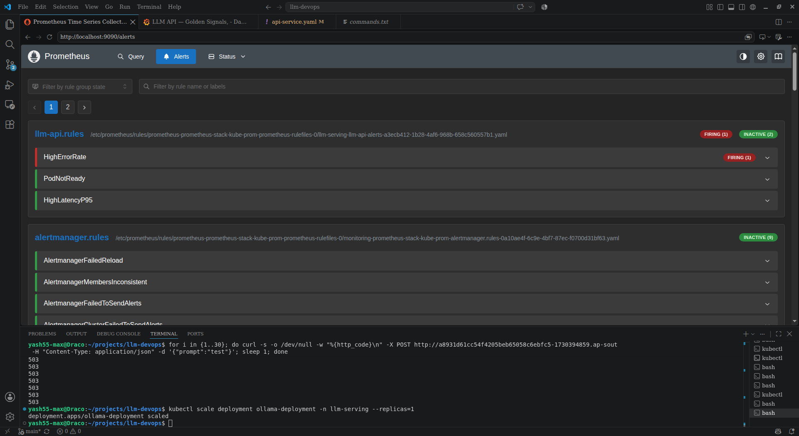
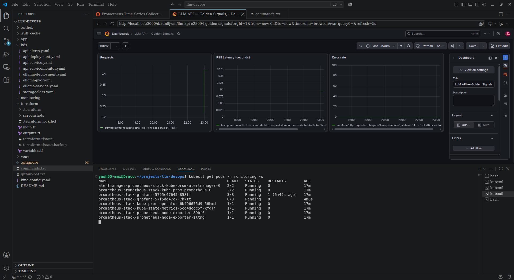
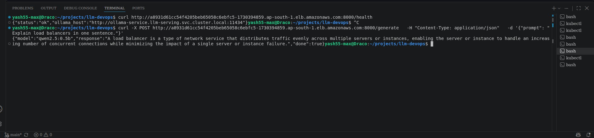
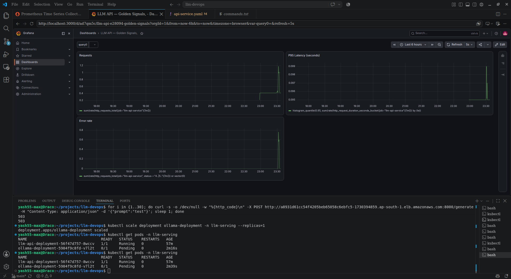
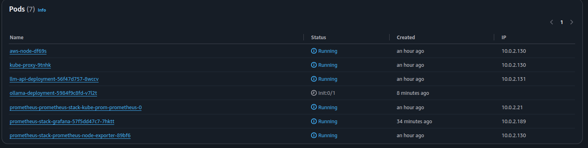

# Production-Grade LLM Infrastructure & MLOps Platform

An end-to-end cloud-native platform for containerized LLM inference serving, automated CI/CD pipelines, Infrastructure as Code (Terraform), and full-stack Kubernetes observability on AWS EKS.

<p align="center">
  
  
  
  
  
  
  
  
  
</p>

---

## Table of Contents

- [Executive Project Summary](#executive-project-summary)
- [Production Architecture](#production-architecture)
- [Core Production Highlights](#core-production-highlights)
- [Technology Stack](#technology-stack)
- [Key Engineering Decisions and Tradeoffs](#key-engineering-decisions-and-tradeoffs)
  - [1. Free Tier Resource Optimization and Capacity Planning](#1-free-tier-resource-optimization-and-capacity-planning)
  - [2. IAM Roles for Service Accounts (IRSA) vs. Node-Level IAM](#2-iam-roles-for-service-accounts-irsa-vs-node-level-iam)
  - [3. AWS EBS Multi-AZ Volume Affinity and Topology Constraints](#3-aws-ebs-multi-az-volume-affinity-and-topology-constraints)
  - [4. Strict Teardown Discipline and Cloud Cost Guardrails](#4-strict-teardown-discipline-and-cloud-cost-guardrails)
- [10-Day Implementation Milestone Summary](#10-day-implementation-milestone-summary)
- [Detailed Day-by-Day Engineering and Debugging Logs](#detailed-day-by-day-engineering-and-debugging-logs)
  - [Day 1: Infrastructure and Local Environment Baseline](#day-1-infrastructure-and-local-environment-baseline)
  - [Day 2: Containerized Ollama Deployment into kind](#day-2-containerized-ollama-deployment-into-kind)
  - [Day 3: Kubernetes Service Discovery and FastAPI Integration](#day-3-kubernetes-service-discovery-and-fastapi-integration)
  - [Day 4: Automated CI/CD Pipeline and Container Registry Integration](#day-4-automated-cicd-pipeline-and-container-registry-integration)
  - [Day 5: Observability Stack — Prometheus, Grafana and Golden Signals Dashboard](#day-5-observability-stack-prometheus-grafana-and-golden-signals-dashboard)
  - [Day 6: Alerting — Alertmanager, PrometheusRule and Incident Lifecycle Validation](#day-6-alerting-alertmanager-prometheusrule-and-incident-lifecycle-validation)
  - [Day 7: Cloud Migration — AWS EC2 via Terraform](#day-7-cloud-migration-aws-ec2-via-terraform)
  - [Day 8: Cloud-Native Migration — EKS, IRSA and Production Kubernetes Friction](#day-8-cloud-native-migration-eks-irsa-and-production-kubernetes-friction)
  - [Day 9: Observability on EKS, Public Exposure and Cross-Environment Validation](#day-9-observability-on-eks-public-exposure-and-cross-environment-validation)
  - [Day 10: CD Loop Completion, GitOps Automation and Portfolio Consolidation](#day-10-cd-loop-completion-gitops-automation-and-portfolio-consolidation)
- [Repository Structure](#repository-structure)
- [Quickstart and Reproduction Guide](#quickstart-and-reproduction-guide)

---

## Executive Project Summary

This project demonstrates the complete engineering lifecycle of deploying and operating an open-source Large Language Model (LLM) serving platform in production. The system transitions from a local multi-node prototyping environment (`kind`) to a fully automated, observable, and secured cloud deployment on Amazon Web Services (AWS EKS) using Infrastructure as Code (Terraform).

### Core Capabilities

- **Resilient Model Serving**: Serves quantized open-source LLMs (`qwen2.5:0.5b`) on CPU-optimized nodes using Ollama with an isolated FastAPI gateway, decoupling model lifecycle and storage from inference execution.
- **Infrastructure as Code (IaC)**: Modular Terraform configurations provisioning an Amazon EKS cluster (Kubernetes v1.35), custom VPC networking, public subnets across multiple AZs, managed node groups, and AWS EBS CSI Driver integrations.
- **Enterprise IAM & Security**: Complete least-privilege security model using AWS IAM Roles for Service Accounts (IRSA) via OIDC, eliminating static AWS credentials and restricting cloud API access per Kubernetes ServiceAccount.
- **Automated CI/CD & GitOps**: GitHub Actions pipeline executing static linting (`ruff`), unit test suites (`pytest`), container image compilation, and immutable SHA-based image publishing to GitHub Container Registry (GHCR).
- **Production Observability and SRE Alerting**: Deployed `kube-prometheus-stack` to monitor SRE Golden Signals (Traffic, Latency, Error Rate). Implemented declarative `PrometheusRule` alerting, debounced incident thresholds, and Alertmanager routing, validated through live fault-injection testing over public AWS Load Balancer endpoints.

---

## Production Architecture

```text
                                  PUBLIC INTERNET
                                         │
                                         │ HTTPS / HTTP (:8000)
                                         ▼
                      ┌────────────────────────────────────┐
                      │    AWS Classic Load Balancer       │
                      │   (*.ap-south-1.elb.amazonaws.com)  │
                      └──────────────────┬─────────────────┘
                                         │
                                         ▼
                          AWS EKS CLUSTER (ap-south-1)
┌─────────────────────────────────────────────────────────────────────────────┐
│  VPC: 10.0.0.0/16                                                           │
│                                                                             │
│  ┌─────────────────────────────────┐   ┌─────────────────────────────────┐  │
│  │ Public Subnet 1 (ap-south-1a)   │   │ Public Subnet 2 (ap-south-1b)   │  │
│  │ Managed Node: t3.small          │   │ Managed Node: t3.small          │  │
│  │                                 │   │                                 │  │
│  │  ┌───────────────────────────┐  │   │  ┌───────────────────────────┐  │  │
│  │  │ FastAPI Serving Pod       │  │   │  │ Ollama Backend Pod        │  │  │
│  │  │ Namespace: llm-serving    │  │   │  │ Namespace: llm-serving    │  │  │
│  │  │ Port: 8000                │──┼───┼─▶│ Port: 11434               │  │  │
│  │  └─────────────┬─────────────┘  │   │  └─────────────┬─────────────┘  │  │
│  │                │                │   │                │                │  │
│  │                │ /metrics       │   │                │ Dynamic Mount  │  │
│  │                ▼                │   │                ▼                │  │
│  │  ┌───────────────────────────┐  │   │  ┌───────────────────────────┐  │  │
│  │  │ Prometheus Server         │  │   │  │ AWS EBS gp3 Volume        │  │  │
│  │  │ Namespace: monitoring     │  │   │  │ (Provisioned by EBS CSI)  │  │  │
│  │  └─────────────┬─────────────┘  │   │  └───────────────────────────┘  │  │
│  │                │                │   │                                 │  │
│  │       ┌────────┴────────┐       │   │  ┌───────────────────────────┐  │  │
│  │       ▼                 ▼       │   │  │ EBS CSI Controller (IRSA) │  │  │
│  │ ┌───────────┐     ┌───────────┐ │   │  │ Namespace: kube-system    │  │  │
│  │ │Alertmanager│     │  Grafana  │ │   │  └─────────────┬─────────────┘  │  │
│  │ └───────────┘     └───────────┘ │   │                │                │  │
│  └─────────────────────────────────┘   └────────────────┼────────────────┘  │
└─────────────────────────────────────────────────────────┼───────────────────┘
                                                          │ OIDC AssumeRole
                                                          ▼
                                            ┌───────────────────────────┐
                                            │ AWS IAM Role: ebs-csi-irsa│
                                            │ Policy: AmazonEBSCSIDriver│
                                            └───────────────────────────┘
```

---

## Core Production Highlights

Key verification milestones across the project's cloud and observability stack:

### 1. Live Public Endpoint Verification on AWS EKS
Live prompt inference and health probe verification over the public AWS Classic Load Balancer endpoint (`ap-south-1.elb.amazonaws.com:8000`):


### 2. SRE Golden Signals Observability on AWS EKS
Production Grafana dashboard tracking real-time Request Rate, P95 Latency, and Error Rate under live cluster traffic:


### 3. SRE Incident Alerting & Lifecycle Validation
Prometheus `HighErrorRate` rule transitioning to `FIRING` during simulated backend failure on AWS EKS:


---

## Technology Stack

| Domain | Technology / Tool | Version | Purpose |
| --- | --- | --- | --- |
| **Cloud and IaC** | AWS EKS, EC2, EBS gp3, ELB, IAM, VPC | AWS CLI v2 | Production cloud hosting and network isolation |
| | HashiCorp Terraform | v1.15 | Declarative Infrastructure as Code and state management |
| **Orchestration and Storage** | Kubernetes | v1.35 / v1.36 | Workload orchestration, scheduling, and service discovery |
| | `kind` (Kubernetes in Docker) | v0.22 | Local multi-node development and prototyping |
| | AWS EBS CSI Driver | v1.40+ | Dynamic persistent storage provisioning via IRSA |
| | Docker | v29 | Containerization and multi-stage image packaging |
| **Application and Serving** | FastAPI & Uvicorn | Latest | High-throughput asynchronous REST inference API |
| | Ollama & Qwen 2.5 (0.5B GGUF) | Latest | Quantized local and cloud CPU-based LLM inference engine |
| | Pydantic & HTTPX | v2 / Latest | Data validation, schema enforcement, and async backend client |
| **Observability and SRE** | Prometheus Operator (`kube-prometheus-stack`) | Helm Chart | Declarative Kubernetes metrics collection and ServiceMonitors |
| | Alertmanager & PrometheusRule | Latest | Automated alert evaluation, debouncing, and notification routing |
| | Grafana | Latest | Version-controlled Golden Signals dashboards (Dashboard-as-Code) |
| | `prometheus-fastapi-instrumentator` | Latest | Custom latency and HTTP request status metrics instrumentation |
| **CI/CD and Code Quality** | GitHub Actions | Latest | Automated multi-stage build, test, and release pipelines |
| | GitHub Container Registry (GHCR) | Latest | Immutable container artifact storage tagged by Git commit SHA |
| | Ruff & Pytest | Latest | High-speed Python linting, style formatting, and unit testing |

---

## Key Engineering Decisions and Tradeoffs

### 1. Free Tier Resource Optimization and Capacity Planning

- **Context**: AWS managed control planes and multi-node compute clusters quickly accumulate costs if over-provisioned.
- **Decision**: Architected the cluster around `t3.small` nodes (2 vCPU, 2GB RAM) under AWS Free Tier eligibility instead of unconstrained default instance sizes like `t3.medium` or `m5.large`.
- **Engineering Judgment**:
  - Uncovered and resolved an `InvalidParameterCombination` ASG failure where `t3.medium` was rejected by AWS Free Tier policies.
  - Sized Ollama's memory requests down from `1Gi` (carried over from unconstrained local Docker environments) to `512Mi` request and `1.5Gi` limit. This ensured system pods (AWS VPC CNI, EBS CSI Driver, CoreDNS, kube-proxy) and application workloads coexisted on 2GB nodes without OOM-kills or scheduling gridlocks.

### 2. IAM Roles for Service Accounts (IRSA) vs. Node-Level IAM

- **Context**: The AWS EBS CSI Controller requires IAM permissions (`ec2:CreateVolume`, `ec2:AttachVolume`, etc.) to dynamically provision EBS volumes for the Ollama model store.
- **Decision**: Implemented an IAM OIDC Identity Provider with a dedicated IAM role bound directly to the Kubernetes ServiceAccount (`system:serviceaccount:kube-system:ebs-csi-controller-sa`) via IRSA, instead of granting the EC2 Node Instance Role broad AWS administrator permissions.
- **Engineering Judgment**:
  - EC2 node-role permissions grant broad access to every pod running on that node, violating the principle of least privilege.
  - IRSA injects temporary STS credentials specifically into the CSI controller pod via Kubernetes service account token projection, isolating AWS API access exclusively to the storage control plane.

### 3. AWS EBS Multi-AZ Volume Affinity and Topology Constraints

- **Context**: The Ollama LLM backend utilizes persistent EBS `gp3` storage (`ollama-pvc`) to persist model weights across restarts.
- **Decision**: Configured the `StorageClass` with `volumeBindingMode: WaitForFirstConsumer` and analyzed cross-AZ volume affinity constraints.
- **Engineering Judgment**:
  - AWS EBS volumes are physical block devices bound to a single Availability Zone (e.g. `ap-south-1a`). When a multi-AZ node group attempts to reschedule a stateful pod to a node in `ap-south-1b`, scheduling fails due to `PersistentVolume node affinity` mismatch.
  - In production systems, this tradeoff is addressed by either:
    1. Pinning stateful worker node groups to a single AZ for lightweight workloads.
    2. Utilizing multi-AZ shared network file storage (AWS EFS CSI Driver) for read-heavy model artifacts.
    3. Deploying StatefulSets with topology-aware pod scheduling constraints.

### 4. Strict Teardown Discipline and Cloud Cost Guardrails

- **Context**: Cloud infrastructure left running outside active development sessions causes budget exhaustion.
- **Decision**: Enforced an automated, dependency-aware teardown workflow executed immediately following verification runs.
- **Engineering Judgment**:
  - **Deletion Ordering**: Kubernetes `Service` objects of `type: LoadBalancer` must be deleted via `kubectl` *prior* to running `terraform destroy`. If Terraform deletes the VPC/subnets before Kubernetes deprovisions the ELB, the AWS Load Balancer becomes orphaned in AWS and continues billing silently.
  - **Orphan Sweeps**: Integrated automated AWS CLI queries into teardown procedures to confirm zero unattached EBS volumes (`status=available`) or dangling ELBs remained.

---

## 10-Day Implementation Milestone Summary

| Day | Focus Domain | Key Accomplishments | Core Architectural Pattern | Detailed Log Link |
| --- | --- | --- | --- | --- |
| **Day 1** | Local Baseline and Guardrails | AWS billing alerts configured, non-root IAM admin role, toolchain verification, 2-node `kind` cluster setup. | Cost-constrained local sandbox environment | [Day 1 Log](#day-1-infrastructure-and-local-environment-baseline) |
| **Day 2** | Containerized LLM Serving | Ollama containerized in `kind`, 5Gi PVC for model weights, `initContainer` bootstrap pattern for `qwen2.5:0.5b`. | Decoupled model storage and lifecycle isolation | [Day 2 Log](#day-2-containerized-ollama-deployment-into-kind) |
| **Day 3** | Microservice Discovery | FastAPI integration, Kubernetes ClusterIP Service, CoreDNS FQDN internal routing. | Dynamic DNS-based microservice discovery | [Day 3 Log](#day-3-kubernetes-service-discovery-and-fastapi-integration) |
| **Day 4** | CI/CD and Image Registry | GitHub Actions workflow, Ruff static linting, Pytest test suite, immutable SHA image tagging to GHCR. | Immutable artifact pipeline and GitOps boundary | [Day 4 Log](#day-4-automated-cicd-pipeline-and-container-registry-integration) |
| **Day 5** | Observability Baseline | `kube-prometheus-stack` via Helm, `/metrics` instrumentation, `ServiceMonitor` CRD, Grafana Golden Signals. | Kubernetes-native declarative metrics scraping | [Day 5 Log](#day-5-observability-stack-prometheus-grafana-and-golden-signals-dashboard) |
| **Day 6** | Alerting and Incident SRE | Alertmanager enabled, `PrometheusRule` CRDs (`HighErrorRate`, `PodNotReady`), live fault injection validation. | SRE alert debounce windows and dashboard-as-code | [Day 6 Log](#day-6-alerting-alertmanager-prometheusrule-and-incident-lifecycle-validation) |
| **Day 7** | Cloud Migration (EC2) | Terraform IaC for EC2 `t3.micro`, Docker bridge network `llm-net`, IP-scoped security groups, GHCR pull. | Production IaC scaffolding and zero-leakage teardown | [Day 7 Log](#day-7-cloud-migration-aws-ec2-via-terraform) |
| **Day 8** | Managed EKS and IRSA | EKS v1.35, managed node groups, OIDC / IRSA for EBS CSI driver, dynamic gp3 StorageClass, resource tuning. | Least-privilege IRSA and portable K8s manifests | [Day 8 Log](#day-8-cloud-native-migration-eks-irsa-and-production-kubernetes-friction) |
| **Day 9** | Cloud Observability and ELB | EKS re-provisioning via IaC, public AWS Classic ELB, live alert validation, multi-AZ EBS analysis. | End-to-end cloud reproducibility and SRE validation | [Day 9 Log](#day-9-observability-on-eks-public-exposure-and-cross-environment-validation) |
| **Day 10** | CD Loop and Consolidation | Closed CD loop with automated GitOps manifest patch workflow, curated screenshots, executive documentation. | Closed-loop GitOps deployment and portfolio consolidation | [Day 10 Log](#day-10-cd-loop-completion-gitops-automation-and-portfolio-consolidation) |

---

## Detailed Day-by-Day Engineering and Debugging Logs

---

### Day 1: Infrastructure and Local Environment Baseline

#### Accomplished

- AWS Billing Guardrails configured with alert caps
- AWS CLI v2 configured with non-root IAM user (`yash-IAM-Admin`)
- Local toolchain verified: Docker v29, kubectl v1.36, kind v0.22, Terraform v1.15
- Local 2-node Kubernetes cluster created using `kind` (`devops-ai-cluster`)
- Ollama local model serving verified

#### Architectural Rationale & Design Patterns

- **Non-root AWS IAM Access**: Used a dedicated IAM administrator identity instead of the AWS root account to reduce operational and security risk.
- **Local Kubernetes via kind**: Chosen to provide a reproducible multi-node Kubernetes environment without incurring cloud infrastructure costs during development.
- **Cost Guardrails**: AWS billing alerts were configured before beginning cloud infrastructure work to prevent unexpected resource consumption.

---

### Day 2: Containerized Ollama Deployment into kind

#### Accomplished

- Ollama containerized and deployed into the local `kind` cluster
- Dedicated Kubernetes namespace configured for LLM serving (`llm-serving`)
- Persistent Volume Claim (`ollama-pvc`) created (5Gi)
- Ollama model storage mounted at `/root/.ollama`
- Init container implemented for automatic model bootstrap
- `qwen2.5:0.5b` model configured for automatic download
- Ollama serving container verified

#### Architectural Rationale & Design Patterns

- **CPU-based Serving**: Retained Ollama GGUF quantized models on CPU to avoid GPU overhead and unnecessary infrastructure costs in local `kind` clusters.
- **Persistent Storage (`ollama-pvc`)**: Mounted a 5Gi PVC to `/root/.ollama` to decouple model-weight storage from pod lifecycles, eliminating unnecessary model re-downloads after pod restarts.
- **Init Container Bootstrap Pattern**: Introduced an `initContainer` named `model-puller` to verify Ollama readiness using `ollama list` and fetch `qwen2.5:0.5b` model weights before the primary serving container starts.
- **Container Lifecycle Separation**: Model initialization is isolated from the serving process, allowing the main Ollama container to start only after the required model artifacts are available.

---

### Day 3: Kubernetes Service Discovery and FastAPI Integration

#### Accomplished

- FastAPI application integrated with the Ollama backend
- Kubernetes Service created for Ollama
- FastAPI configured to communicate with Ollama through Kubernetes DNS
- Hardcoded Pod IP addressing eliminated
- Internal service communication established using the Kubernetes FQDN

#### Architectural Rationale & Design Patterns

- **Kubernetes DNS-Based Service Discovery**: The FastAPI layer communicates with the Ollama backend using the Kubernetes CoreDNS domain:
  `http://ollama-service.llm-serving.svc.cluster.local:11434`
- **Dynamic IP Assignment**: Pod IPs and Service ClusterIPs are dynamic. Hardcoding IP addresses makes the application fragile whenever pods are rescheduled or services are recreated.
- **Namespace-Scoped Discovery**: Kubernetes Fully Qualified Domain Names follow the standard format:
  `<service-name>.<namespace>.svc.cluster.local`
  This allows services to communicate reliably across namespaces without depending on the underlying cluster topology.
- **Decoupled Architecture**: FastAPI depends on the stable Kubernetes Service abstraction rather than individual Ollama pods. This allows the Ollama backend to scale horizontally without requiring application-level configuration changes.

#### Service Communication Flow

```text
                    Kubernetes Cluster
┌─────────────────────────────────────────────────────────────┐
│                                                             │
│  ┌──────────────────┐                                       │
│  │   FastAPI Pod    │                                       │
│  │                  │                                       │
│  │  API / Inference │                                       │
│  └────────┬─────────┘                                       │
│           │                                                 │
│           │ Kubernetes DNS                                  │
│           │ ollama-service.llm-serving.svc.cluster.local    │
│           ▼                                                 │
│  ┌──────────────────┐                                       │
│  │ Ollama Service   │                                       │
│  │                  │                                       │
│  │ ClusterIP:11434  │                                       │
│  └────────┬─────────┘                                       │
│           │                                                 │
│           ▼                                                 │
│  ┌──────────────────┐                                       │
│  │   Ollama Pod     │                                       │
│  │                  │                                       │
│  │ qwen2.5:0.5b     │                                       │
│  └──────────────────┘                                       │
│                                                             │
└─────────────────────────────────────────────────────────────┘
```

---

### Day 4: Automated CI/CD Pipeline and Container Registry Integration

#### Accomplished

- Automated CI/CD workflow created using GitHub Actions (`.github/workflows/ci.yaml`)
- Code quality and linting automated using `ruff`
- Automated unit test suite implemented using `pytest`
- Pydantic schema validation verified
- `/health` probe logic verified
- Container image builds automated
- Container images published to GitHub Container Registry (GHCR)
- Immutable image tagging strategy implemented using Git commit SHAs (`${{ github.sha }}`)

#### Architectural Rationale & Design Patterns

- **Static Code Analysis (`ruff`)**: Integrated high-performance Python linting into the CI pipeline to enforce code-quality standards and maintain consistent import ordering before container image assembly.
- **Automated Verification (`pytest`)**: Unit tests execute automatically on every push and pull request targeting `main`. This provides an early validation layer for API behavior, Pydantic schemas, and health-check endpoints before artifacts are built.
- **Immutable Artifact Strategy**: Container images are tagged using the Git commit SHA (`${{ github.sha }}`), creating a deterministic relationship between source code and the resulting artifact. This avoids the ambiguity associated with mutable tags such as `:latest`.
- **GitHub Container Registry (GHCR)**: GHCR is used as the centralized container artifact registry, providing a persistent location for versioned images that can later be consumed by Kubernetes or a GitOps deployment controller.
- **Deliberate Deployment Boundary**: The CI pipeline intentionally terminates after publishing the container image and updating the deployment manifest.

#### CI/CD Pipeline Flow

```text
                         Git Repository
                               │
                               │ Push / Pull Request
                               ▼
                     ┌─────────────────────┐
                     │    GitHub Actions   │
                     │      CI Runner      │
                     └──────────┬──────────┘
                                │
                   ┌────────────┼────────────┐
                   │            │            │
                   ▼            ▼            ▼
              ┌────────┐   ┌────────┐   ┌─────────────┐
              │  Ruff  │   │ Pytest │   │ Pydantic /  │
              │ Linting│   │  Tests │   │ Health Check│
              └────┬───┘   └────┬───┘   └──────┬──────┘
                   │            │              │
                   └────────────┼──────────────┘
                                │
                          Validation Pass
                                │
                                ▼
                     ┌─────────────────────┐
                     │  Docker Image Build │
                     └──────────┬──────────┘
                                │
                                │ Tag: <github-sha>
                                ▼
                     ┌─────────────────────┐
                     │        GHCR         │
                     │ GitHub Container    │
                     │      Registry       │
                     └──────────┬──────────┘
                                │
                                │ GitOps Sync
                                ▼
                     ┌─────────────────────┐
                     │ k8s Manifest Update │
                     └─────────────────────┘
```

---

### Day 5: Observability Stack — Prometheus, Grafana and Golden Signals Dashboard

#### Accomplished

- FastAPI application instrumented using `prometheus-fastapi-instrumentator`
- `/metrics` endpoint exposed on the API service
- `kube-prometheus-stack` deployed via Helm into a dedicated `monitoring` namespace
- `ServiceMonitor` (`llm-api-servicemonitor`) configured to scrape the API service
- Prometheus target verified as `UP` with successful scrape health
- Grafana dashboard built with three golden-signal panels: Request rate, P95 latency, Error rate
- Dashboard exported as JSON and version-controlled (`monitoring/dashboards/golden-signals.json`)
- Load-tested end-to-end pipeline to validate live metric flow

#### Dashboard Preview


#### Architectural Rationale & Design Patterns

- **`kube-prometheus-stack` over hand-rolled manifests**: Used the community Helm chart (Prometheus + Grafana + Alertmanager bundled) rather than deploying each component manually, mirroring standard enterprise operations.
- **ServiceMonitor as the scrape-config abstraction**: Declaratively defines metric endpoints reconciled by the Prometheus Operator.
- **Golden Signals over exhaustive metrics**: Dashboard limits scope to request rate, latency (p95), and error rate—the three signals directly tied to service health.

#### Debugging Log

1. **Prometheus silently ignoring the ServiceMonitor (label selector mismatch)**
   - Symptom: `ServiceMonitor` existed, but Prometheus's Service Discovery page showed nothing.
   - Root cause: `kube-prometheus-stack`'s Prometheus CR only watches `ServiceMonitors` carrying a `release: prometheus-stack` label by default (`spec.serviceMonitorSelector.matchLabels`). The custom `ServiceMonitor` lacked this label.
   - Fix: Added `labels: { release: prometheus-stack }` to the `ServiceMonitor` metadata and re-applied.

2. **ServiceMonitor discovered, but "0/0 No targets"**
   - Symptom: Label fix resolved discovery, but the scrape pool showed zero targets.
   - Root cause: The underlying `Service` (`llm-api-service`) had zero running pods (`0/0` replicas).
   - Fix: Scaled deployments to 1 replica (`kubectl scale deployment <name> -n llm-serving --replicas=1`).

3. **Target `UP` in discovery, but scraping failed with `404 Not Found`**
   - Symptom: Prometheus reached the pod over the network, but `/metrics` returned 404.
   - Root cause: The running pod was serving an older image built before Prometheus instrumentation was added to `main.py`.
   - Fix: Rebuilt image, reloaded into `kind`, bumped manifest tag, and re-applied.

4. **Port drift between local YAML, live cluster state, and the container**
   - Symptom: `kubectl port-forward` failed with "Service does not have a service port 8001."
   - Root cause: `api-service.yaml` had been locally edited to `port: 8001` but never re-applied, while Dockerfile and Service were on `8000`.
   - Fix: Reverted Service manifest to `8000`, re-applied, and verified parity.

#### Golden Signals Queries (PromQL)

```promql
# Request Rate
sum(rate(http_requests_total{job="llm-api-service"}[1m]))

# P95 Latency
histogram_quantile(0.95, sum(rate(http_request_duration_seconds_bucket{job="llm-api-service"}[1m])) by (le))

# Error Rate
sum(rate(http_requests_total{job="llm-api-service", status=~"4..|5.."}[1m])) or vector(0)
```

---

### Day 6: Alerting — Alertmanager, PrometheusRule and Incident Lifecycle Validation

#### Accomplished

- Alertmanager enabled via Helm upgrade
- Verified Prometheus to Alertmanager delivery path via `alerting.alertmanagers` config
- Three `PrometheusRule` alerts authored and deployed (`k8s/api-alerts.yaml`):
  - `HighErrorRate` — fires when 5xx ratio exceeds 5% for 2+ minutes
  - `PodNotReady` — fires when any pod in `llm-serving` is not-ready for 1+ minute
  - `HighLatencyP95` — fires when p95 latency exceeds 2s for 5+ minutes
- Forced a real outage (Ollama scaled to zero) to validate the full alert lifecycle
- Confirmed alert transition: `Inactive` -> `Pending` -> `Firing` -> resolved
- Confirmed alert delivery into Alertmanager's UI
- Diagnosed and fixed Grafana dashboard persistence bug via PVC configuration

#### Incident and Alert Validation Previews

#### Full Golden Signals Incident Lifecycle Dashboard


#### Error Rate Spike Drilldown (Threshold Breach at 01:03:30)


#### Prometheus Alert State Transition: Pending (01:04:48)
*Threshold breached; alert enters the 2-minute debounce window (`for: 2m`) to prevent transient false alarms:*


#### Prometheus Alert State Transition: Firing (01:06:23)
*Failure condition sustained for over 2 minutes; alert transitions to FIRING and routes to Alertmanager:*


#### Architectural Rationale & Design Patterns

- **`PrometheusRule` CRD**: Alert rules live as version-controlled Kubernetes objects reconciled automatically by the Prometheus Operator.
- **`for:` duration debouncing**: Every alert requires its condition to hold for a sustained window (1-5 minutes) before firing, preventing alert fatigue from transient spikes.
- **Real outage validation**: Validated alerts by taking Ollama offline and observing real HTTP 503 error rates from the FastAPI gateway.
- **Dashboard-as-Code**: Grafana dashboards versioned in JSON to prevent data loss across pod lifecycles.

#### Debugging Log

1. **Alertmanager pods not running**
   - Root cause: `alertmanager.enabled: false` was set in base values.
   - Fix: Upgraded Helm release with `--set alertmanager.enabled=true` and custom resource bounds.

2. **Control-plane noise alerts in kind**
   - Symptom: 10 alerts in `kube-system` fired continuously (`etcdInsufficientMembers`, etc.).
   - Root cause: `kind` does not expose cloud control-plane metrics. Identified as expected local noise.

3. **Grafana dashboard lost after Helm upgrade**
   - Root cause: Grafana default uses ephemeral SQLite DB.
   - Fix: Re-imported from `golden-signals.json` and enabled persistent storage via `--set grafana.persistence.enabled=true --set grafana.persistence.size=1Gi`.

---

### Day 7: Cloud Migration — AWS EC2 via Terraform

#### Accomplished

- Provisioned real AWS infrastructure using Terraform (`terraform/`):
  - Single `t3.micro` EC2 instance (Ubuntu, 25Gi gp3 root volume)
  - Dedicated security group scoped to the operator's IP (SSH + port 8000)
  - SSH key pair generated and managed via Terraform
- Installed Docker and deployed containers on EC2
- Configured custom Docker bridge network (`llm-net`) for container-name DNS resolution
- Pulled API image from GHCR
- Verified `/health` and `/generate` endpoints over the public EC2 IPv4 address
- Executed full teardown via `terraform destroy` with zero residual billing

#### Deployment and Verification Previews

#### EC2 Container Setup & Docker Bridge Network


#### Public Internet Endpoint Verification


#### Architectural Rationale & Design Patterns

- **EC2 + Docker staging step**: Scoped initial cloud migration to plain Docker on EC2 to validate cloud networking, security groups, and registry authentication before incurring managed EKS control plane costs.
- **Strict security group scoping**: SSH (22) and API (8000) locked to the operator's IP using `data.http` lookup at apply time.
- **Docker bridge network**: Enabled internal hostname discovery (`http://ollama:11434`), mirroring Kubernetes CoreDNS patterns.
- **Aggressive teardown discipline**: Infrastructure destroyed immediately after verification to stay within cloud budget.

#### Debugging Log

1. **GHCR pull denied**
   - Root cause: Container image repository name was `llm-devops`, not `llm-api`.
   - Fix: Corrected image path to `ghcr.io/yash55-max/llm-devops:latest`.

2. **SSH session terminated mid-verification**
   - Root cause: `terraform destroy` triggered from local terminal destroyed instance immediately upon verification completion. Expected lifecycle behavior.

---

### Day 8: Cloud-Native Migration — EKS, IRSA and Production Kubernetes Friction

#### Accomplished

- Extended Terraform configuration to provision a production EKS cluster:
  - EKS control plane (Kubernetes 1.35)
  - Managed node group (2x `t3.small`, Free Tier eligible)
  - IAM OIDC Provider for IAM Roles for Service Accounts (IRSA)
  - AWS EBS CSI Driver addon with dedicated IRSA role
- Reapplied existing Kubernetes manifests (`k8s/`) with minimal changes
- Created dynamic `StorageClass` (`ebs-gp3`) set as default
- Right-sized Ollama resource requests/limits for 2GB node capacity
- Created GHCR image pull secrets for private container registry access
- Verified full request flow: `curl` -> API pod -> Kubernetes DNS -> Ollama pod -> response
- Teardown verified via `terraform destroy` and manual EBS orphan checks

#### Deployment and Verification Previews

#### EKS End-to-End Endpoint Verification


#### EKS Node Capacity & Pod Allocation


#### AWS EKS Node & Kubelet Lifecycle Events


#### Architectural Rationale & Design Patterns

- **IRSA over node-role IAM**: The EBS CSI controller calls AWS APIs using a dedicated IAM role bound to its service account via OIDC, enforcing least privilege.
- **Manifest Portability**: Kubernetes manifests written for `kind` deployed onto AWS EKS with zero structural rewrites, proving cloud-native portability.
- **Resource Right-Sizing**: Tuned container requests to operate reliably on resource-constrained cloud nodes.

#### Debugging Log

1. **EKS cluster created with end-of-support Kubernetes version**
   - Root cause: Hardcoded `version = "1.30"` had aged out of AWS standard support.
   - Fix: Re-provisioned with `version = "1.35"` (standard support through March 2027).

2. **Node group launch failure (`InvalidParameterCombination`)**
   - Symptom: Node group stuck in `CREATING` for 30+ minutes without launching instances.
   - Root cause: Configured `t3.medium` instance type was not Free Tier eligible on this account.
   - Fix: Switched to `t3.small` (verified Free Tier eligible); node group came up in under 2 minutes.

3. **EBS CSI controller pods CrashLoopBackOff with HTTP 500**
   - Root cause: CSI controller pod lacked dedicated IAM role via IRSA.
   - Fix: Added `aws_iam_openid_connect_provider`, created `aws_iam_role.ebs_csi_irsa` trusted by `system:serviceaccount:kube-system:ebs-csi-controller-sa`, and attached to the addon.

4. **PVC stuck Pending**
   - Root cause: EKS provides no default StorageClass out of the box.
   - Fix: Deployed `k8s/storageclass.yaml` (`ebs-gp3` provisioner with `volumeBindingMode: WaitForFirstConsumer`).

5. **Ollama pod unschedulable (Insufficient Memory)**
   - Root cause: Inherited `1Gi` memory request from unconstrained local `kind`.
   - Fix: Sized down request to `512Mi` (limit `1.5Gi`), pod scheduled immediately.

6. **API pod ImagePullBackOff**
   - Root cause: Missing registry prefix and missing private registry pull secret.
   - Fix: Set image path to `ghcr.io/yash55-max/llm-devops:<sha>` and added `imagePullSecrets: [name: ghcr-secret]`.

---

### Day 9: Observability on EKS, Public Exposure and Cross-Environment Validation

#### Accomplished

- Recreated full EKS cluster from scratch via Terraform, validating complete IaC reproducibility
- Deployed `kube-prometheus-stack` via Helm with pre-sized resource limits
- Reapplied `ServiceMonitor` and `PrometheusRule` manifests on live cloud cluster
- Re-imported Golden Signals Grafana dashboard from version-controlled JSON
- Exposed FastAPI serving layer via AWS Classic Load Balancer (`type: LoadBalancer`)
- Verified end-to-end inference over public ELB DNS endpoint
- Triggered real `HighErrorRate` alert over public endpoint and verified Prometheus/Grafana state transition
- Diagnosed multi-AZ EBS scheduling constraint during pod recreation
- Clean teardown: Deprovisioned LoadBalancer Service first, followed by `terraform destroy` and orphan verification

#### Observability and Infrastructure Previews

#### EKS Golden Signals Dashboard & Monitoring Stack


#### AWS Classic Load Balancer Public Endpoint Verification


#### Prometheus Alert Lifecycle: Firing on Cloud Infrastructure


#### Synchronized Golden Signals Incident Metrics (Grafana)


#### AWS Console Workload Pods Overview


#### Architectural Rationale & Design Patterns

- **IaC Reproducibility**: Tested full cluster rebuild from empty state to prove zero drift.
- **Public Ingress via LoadBalancer Service**: Integrated AWS Classic Load Balancer for public inference traffic.
- **Teardown Sequencing**: Deleting the Kubernetes `LoadBalancer` Service prior to `terraform destroy` ensures the cloud-provider controller deprovisions the underlying ELB cleanly, avoiding orphaned cloud resources.

#### Debugging Log

1. **Grafana pod stuck 2/3 Running (SQLITE_BUSY / timeouts)**
   - Root cause: Plugin initializations during startup throttled by default `200m` CPU limit.
   - Fix: Upgraded Helm values to `grafana.resources.limits.cpu: 750m`; pod reached `3/3 Running`.

2. **ELB DNS unresolvable immediately after provisioning**
   - Symptom: `curl` returned `NXDOMAIN` for several minutes after `kubectl get svc` showed external hostname.
   - Root cause: Standard DNS propagation delay for newly registered AWS ELB records.
   - Resolution: Verified AWS ELB state was active via AWS CLI and waited for DNS propagation (~10 minutes).

3. **Multi-AZ EBS Volume Affinity Scheduling Failure**
   - Symptom: Ollama pod stayed `Pending` with `PersistentVolume's node affinity mismatch`.
   - Root cause: EBS volume was provisioned in `ap-south-1a`, while the worker node with free memory was in `ap-south-1b`. EBS volumes cannot attach across Availability Zones.
   - Takeaway: Single-replica stateful workloads on multi-AZ node groups require AZ pinning, StatefulSet topology spread constraints, or shared multi-AZ storage (EFS).

#### Verified Public Endpoint Output

```bash
curl http://a8931d61cc54f4205beb65058c6ebfc5-1730394859.ap-south-1.elb.amazonaws.com:8000/health
# {"status":"ok","ollama_host":"http://ollama-service.llm-serving.svc.cluster.local:11434"}

curl -X POST http://a8931d61cc54f4205beb65058c6ebfc5-1730394859.ap-south-1.elb.amazonaws.com:8000/generate   -H "Content-Type: application/json"   -d '{"prompt": "Explain load balancers in one sentence."}'
# {"model":"qwen2.5:0.5b","response":"A load balancer is a type of network service
#  that distributes traffic evenly across multiple servers or instances, enabling the
#  server or instance to handle an increasing number of concurrent connections while
#  minimizing the impact of a single server or instance failure.","done":true}
```

---

---

### Day 10: CD Loop Completion, GitOps Automation and Portfolio Consolidation

#### Accomplished

- Automated GitOps Continuous Delivery (CD) loop engineered within GitHub Actions (`.github/workflows/ci.yaml`):
  - Added dedicated `deploy` workflow job executing on pushes to `main`
  - Dynamically extracts the published container image tag (Git commit SHA) from the build step
  - Automatically updates the deployment manifest (`k8s/api-deployment.yaml`) with the exact immutable image reference
  - Automatically commits and pushes the updated manifest back to the repository using `[skip ci]` to prevent workflow loops
- Curated and centralized top production verification artifacts into a dedicated `docs/screenshots/` repository directory:
  - `01_eks_elb_public_endpoint_verification.png` — Public Load Balancer live endpoint verification
  - `02_eks_golden_signals_dashboard.png` — Full Grafana Golden Signals observability on AWS EKS
  - `03_eks_prometheus_alert_firing.png` — Live Prometheus incident alerting lifecycle
- Authored professional top-level platform documentation (`README.md`):
  - Tech stack badges and executive project summary
  - Production architecture and service topology diagrams
  - Dedicated "Key Engineering Decisions" section covering Free Tier capacity planning, IRSA least privilege, EBS multi-AZ tradeoffs, and teardown discipline
  - 10-day milestone summary table with direct links to all daily technical and debugging logs
  - Zero-emoji formatting strictly maintained across the entire portfolio

#### Architectural Rationale and Design Patterns

- **GitOps Manifest Synchronization over Imperative Cluster Mutation**: Rather than executing imperative `kubectl set image` commands against a remote cluster from CI runners (which requires storing long-lived cloud credentials in GitHub Secrets and creates configuration drift between Git and the cluster), the CD loop declaratively updates `k8s/api-deployment.yaml` in Git. This makes the Git repository the absolute single source of truth for the desired cluster state.
- **Workflow Loop Prevention (`[skip ci]`)**: Automated commits generated by GitHub Actions bots include the `[skip ci]` commit directive to prevent recursive CI triggering while preserving full commit history and audit trails.
- **Documentation as an SRE Artifact**: Designed the README to serve as an operational runbook and architectural defense document, explicitly articulating failure modes, root cause analyses, and trade-off rationales encountered throughout the 10-day engineering sprint.

#### Completed End-to-End GitOps Continuous Delivery Loop

```text
  Developer / Feature Branch
              │
              │ Git Push / Pull Request
              ▼
   ┌──────────────────────┐
   │ GitHub Actions CI/CD │
   └──────────┬───────────┘
              │
              ├─► Job 1: Lint & Unit Tests (Ruff, Pytest)
              │
              ├─► Job 2: Build & Push Container (GHCR with Git SHA)
              │
              └─► Job 3: GitOps CD Sync
                         │
                         ├─► Extract Image Tag (SHA)
                         ├─► Update k8s/api-deployment.yaml
                         └─► Git Commit & Push to main [skip ci]
                                    │
                                    ▼
                         ┌──────────────────────┐
                         │   Git Repository     │
                         │ (Single Source Truth)│
                         └──────────┬───────────┘
                                    │
                                    ▼
                         ┌──────────────────────┐
                         │   AWS EKS Cluster    │
                         │ (llm-serving / apps) │
                         └──────────────────────┘
```

---

## Repository Structure

```text
llm-devops/
├── .github/
│   └── workflows/
│       └── ci.yaml                    # Automated lint, test, build, push, & manifest sync
├── app/
│   ├── Dockerfile                     # Optimized Python 3.11 container image
│   ├── main.py                        # FastAPI inference gateway with Prometheus metrics
│   ├── requirements.txt               # App dependencies (FastAPI, httpx, instrumentator)
│   └── tests/
│       ├── __init__.py
│       └── test_main.py               # Automated pytest suite for API & health logic
├── docs/
│   └── screenshots/                   # Curated production verification highlights
│       ├── 01_eks_elb_public_endpoint_verification.png
│       ├── 02_eks_golden_signals_dashboard.png
│       └── 03_eks_prometheus_alert_firing.png
├── k8s/
│   ├── api-alerts.yaml                # PrometheusRule alerts (HighErrorRate, PodNotReady)
│   ├── api-deployment.yaml            # FastAPI Deployment with GHCR image & pull secrets
│   ├── api-service.yaml               # LoadBalancer / ClusterIP Service for API ingress
│   ├── api-servicemonitor.yaml        # ServiceMonitor CRD for Prometheus Operator
│   ├── ollama-deployment.yaml         # Ollama LLM pod with initContainer model bootstrap
│   ├── ollama-pvc.yaml                # PersistentVolumeClaim for model storage
│   ├── ollama-service.yaml            # Internal ClusterIP Service for Ollama
│   └── storageclass.yaml              # AWS EBS gp3 StorageClass (WaitForFirstConsumer)
├── monitoring/
│   └── dashboards/
│       ├── golden-signals.json        # Exported Grafana Golden Signals dashboard (IaC)
│       └── *.png                      # Raw dashboard & alert verification captures
├── terraform/
│   ├── main.tf                        # VPC, EKS Cluster, Node Group, IRSA, & EBS CSI Addon
│   ├── outputs.tf                     # EKS cluster endpoint, CA data, & security group IDs
│   ├── variables.tf                   # Region, cluster name, and instance type variables
│   └── screenshots/                   # Terraform & EC2/EKS verification captures
├── kind-config.yaml                   # 2-node local Kubernetes cluster configuration
└── README.md                          # Top-level platform documentation
```

---

## Quickstart and Reproduction Guide

### Prerequisites

- AWS CLI v2 configured with appropriate IAM permissions
- Terraform v1.5+
- kubectl v1.30+
- Helm v3+
- Docker v25+

### 1. Provision AWS EKS Infrastructure via Terraform

```bash
cd terraform
terraform init
terraform apply -auto-approve
```

### 2. Configure kubectl Context

```bash
aws eks update-kubeconfig --region ap-south-1 --name devops-ai-eks
kubectl get nodes
```

### 3. Deploy StorageClass and Persistent Volume

```bash
kubectl apply -f k8s/storageclass.yaml
kubectl create namespace llm-serving
kubectl apply -f k8s/ollama-pvc.yaml
```

### 4. Deploy LLM Serving Layer & API Gateway

```bash
# Create GHCR registry secret for private image pulls
kubectl create secret docker-registry ghcr-secret   --docker-server=ghcr.io   --docker-username=<GITHUB_USERNAME>   --docker-password=<GITHUB_PAT>   -n llm-serving

# Deploy Ollama and FastAPI
kubectl apply -f k8s/ollama-deployment.yaml
kubectl apply -f k8s/ollama-service.yaml
kubectl apply -f k8s/api-deployment.yaml
kubectl apply -f k8s/api-service.yaml
```

### 5. Deploy Prometheus Observability Stack

```bash
helm repo add prometheus-community https://prometheus-community.github.io/helm-charts
helm repo update

helm install prometheus-stack prometheus-community/kube-prometheus-stack   --namespace monitoring   --create-namespace   --set alertmanager.enabled=true   --set grafana.persistence.enabled=true   --set grafana.persistence.size=1Gi   --set grafana.resources.limits.cpu=750m

# Apply ServiceMonitor and Alerting Rules
kubectl apply -f k8s/api-servicemonitor.yaml
kubectl apply -f k8s/api-alerts.yaml
```

### 6. Verify Public Endpoint

```bash
# Retrieve Load Balancer public hostname
kubectl get svc llm-api-service -n llm-serving -w

# Test inference
curl -X POST http://<ELB_HOSTNAME>:8000/generate   -H "Content-Type: application/json"   -d '{"prompt": "What is Site Reliability Engineering?"}'
```

### 7. Clean Teardown Protocol

```bash
# 1. Delete LoadBalancer Service first to deprovision AWS ELB cleanly
kubectl delete svc llm-api-service -n llm-serving

# 2. Destroy Terraform infrastructure
cd terraform
terraform destroy -auto-approve

# 3. Verify zero orphaned AWS resources
aws ec2 describe-volumes --region ap-south-1 --filters "Name=status,Values=available" --query 'Volumes[].VolumeId'
aws elb describe-load-balancers --region ap-south-1 --query 'LoadBalancerDescriptions[].LoadBalancerName'
```
